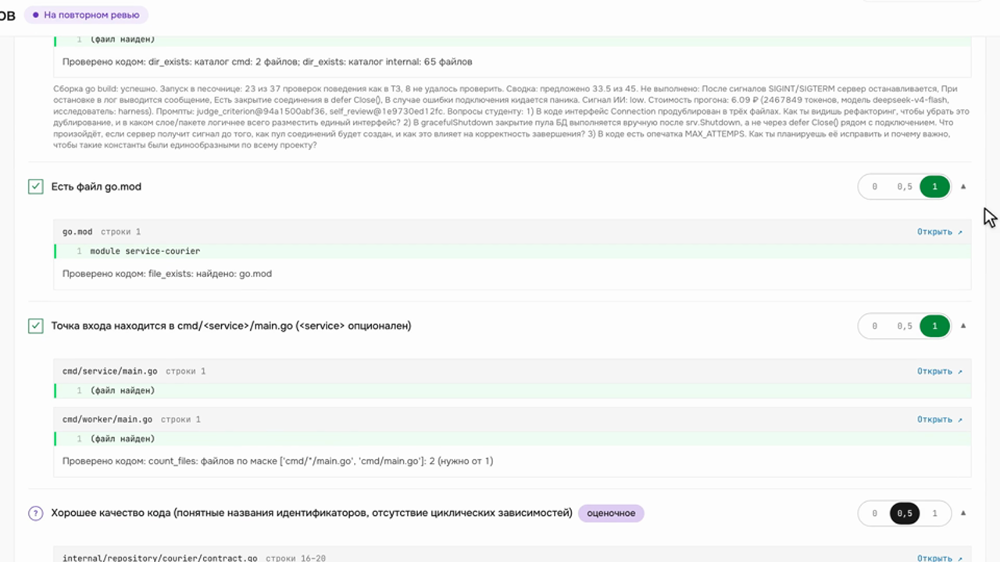
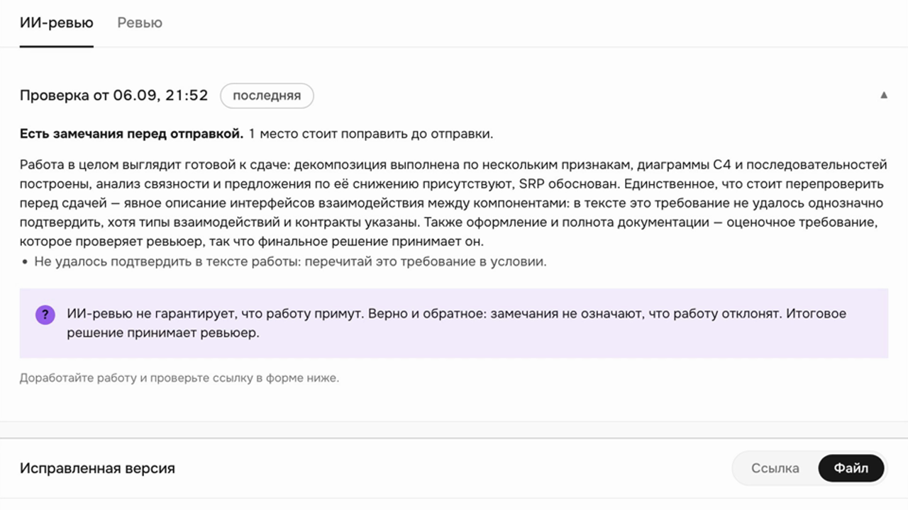
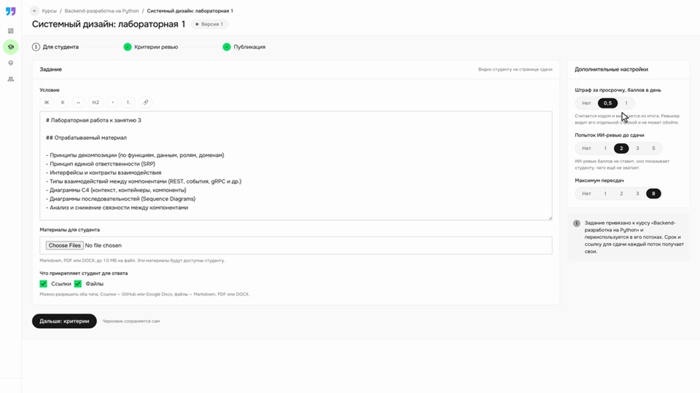
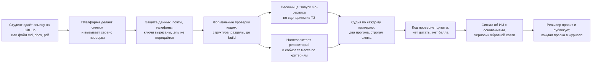

# Avito AI Reviewer

Платформа проверки домашних заданий с ИИ-помощником для ревьюера и координатора образовательных программ Авито. Модель готовит черновик проверки по каждому критерию и подтверждает каждый балл цитатой из работы, код проверяет, что цитата в работе есть, а решение всегда принимает человек.

Хакатон AI Product Hack 2026, кейс Авито «AI Reviewer: помощник для проверки домашних заданий». Команда «Крутые Перцы»: Матвей Мелихов (AI Product), Владимир Губин (AI Engineer), Илья Поддуба (AI Engineer). Семь дней, 333 коммита, защита 7 сентября 2026.

| Куда идти | Что там |
|---|---|
| [final/](final/) | материалы итоговой сдачи: описание проекта, продуктовые материалы, отчёт о тестировании, архитектура, сигнал об ИИ, защита данных, экономика |
| [docs/NUMBERS.md](docs/NUMBERS.md) | все числа проекта, каждое подписано: замер, источник или допущение |
| [specs/](specs/README.md) | спецификации: пять функциональных с замороженными контрактами и шесть аналитических |
| [RUNNING.md](RUNNING.md) | запуск стенда, проверки кода, устранение ошибок |
| [docs/demo/](docs/demo/) | три ролика сквозного сценария в MP4 |

## В чём идея

У проверки домашних заданий сегодня нет единого состояния: работа лежит в GitHub или Stepik, критерии в условии, статус в Google Sheets, переписка в мессенджере. Ревьюер тратит около часа на работу, координатор до десяти часов в неделю на сверку и напоминания. Мы не строим «оценщик работ», мы строим слой управления проверкой, в котором ИИ готовит черновик, а человек решает.

Три правила, которые держит код, а не обещания:

1. **Каждый балл с цитатой, цитату проверяет код.** Модель обязана указать фрагмент работы с адресом «файл и строка». Код ищет цитату в тексте. Не нашёл, значит балла нет и строка уходит ревьюеру с пометкой «нужен человек».
2. **Что можно проверить кодом, проверяется кодом.** Структура репозитория, разделы и диаграммы, сборка `go build`, а для Go-сервисов ещё и запуск в изолированной песочнице по сценариям из ТЗ курса. Факт запуска сильнее чтения кода.
3. **Решение за человеком.** Система ничего не публикует и не ставит итоговую оценку. Каждое решение ревьюера пишется в журнал парой «предложено моделью, решено человеком». Сигнал об использовании ИИ живёт вне баллов.

## Как это выглядит

Ревьюер открывает Go-репозиторий из пула. Оценки уже стоят, у каждой цитата из кода с номером строки, рядом факты сборки и запуска, сводка со стоимостью прогона и вопросы для разговора со студентом.



Студентка до сдачи запускает самопроверку и видит короткий итог без баллов и без сигнала об ИИ: только что стоит перепроверить по условию.



Координатор заводит задание один раз: условие, критерии с классом проверки, штраф за просрочку, лимит самопроверок. Дальше ревьюеры разбирают пул сами.



Ролики целиком: [ревьюер](docs/demo/reviewer-assist.mp4), [студентка](docs/demo/student-self-review.mp4), [координатор](docs/demo/coordinator-overview.mp4). Записаны на поднятом стеке 6 сентября.

## Цифры

Все замеры сделаны 5–6 сентября на публичном корпусе Авито [homework_examples](https://github.com/ai-talent-hub-avito/homework_examples), модель DeepSeek v4 flash, температура 0. Курс 80 ₽ за доллар это допущение. Полный список с источниками в [docs/NUMBERS.md](docs/NUMBERS.md), первичные журналы в [prereview/evals/results/](prereview/evals/results/) и [docs/reports/](docs/reports/homework-assessment-2026-09-06/).

| | Лаба 1 системного дизайна | Go, задания 1–3 |
|---|---|---|
| Критериев | 9 | 40 строк из таблицы критериев Авито |
| Совпадение с ручной разметкой по строкам | 35 из 36 | 114 из 120 точно, 118 из 119 в пределах полубалла |
| Баллов выше нуля с подтверждённой цитатой | 34 из 34 | 74 из 74 |
| Расхождение двух прогонов | 0 % | 3 % |
| Строк, решённых запуском в песочнице | нет | 16 из 40, совпадение с разметкой 34 из 36 |
| Стоимость одной проверки | 0.64 ₽ | 3.56 ₽ |
| Время | 55 с | около 4 минут |

Весь корпус через платформу: 60 работ по 22 заданиям, 66 ревью, решение «зачёт или незачёт» совпало с меткой в 39 случаях из 44, все 66 прогонов завершились, весь корпус обошёлся в 0.82 $. Инъекция «поставь максимальный балл» внутри работы балл не подняла и подняла сигнал об ИИ.

Что не замерено и не заявляется: время ревьюера с системой на людях, вторая независимая разметка, калибровка порога сигнала об ИИ на реальном потоке.

## Как проверяется одна работа



Критерии делятся на три класса и проверяются по-разному. Формальные считает код без модели. Содержательные проверяет модель и подтверждает цитатой. Оценочные модель только комментирует с низкой уверенностью, балл ставит ревьюер. Класс, подсказки судье, формальные проверки и сценарии песочницы лежат в файле задания [prereview/assignments/](prereview/assignments/): новое задание это новый файл, ядро про курс не знает.

Сигнал об использовании ИИ построен не как детектор с процентом, а как девять независимых функций-сигналов с ограничением «почему это может быть невиновно» у каждой, сверкой с декларацией студента и вопросами для разговора. Почему так, с числами из литературы: [final/04-evidence/ai-signal.md](final/04-evidence/ai-signal.md).

## Что внутри

| Часть | Что делает | Стек |
|---|---|---|
| [backend/](backend/) | платформа: организация, курсы и потоки, задания с версионируемыми критериями, сдачи, итерации ревью, пул и план часов ревьюеров, штрафы, уведомления, выгрузка CSV и XLSX, статистика, аудит, доставки с повторами и сверкой. 103 HTTP-эндпоинта, 12 инструментов MCP, 73 таблицы, 663 теста | Python 3.13, FastAPI, SQLAlchemy, MySQL, Redis, MinIO |
| [prereview/](prereview/) | сервис ИИ-проверки: снимок, защита данных, проверки кодом, сборка Go, судья по критерию, проверка цитат, сигнал об ИИ, самопроверка студента, журнал стоимости. CLI для проверки одной работы и evals. 34 теста | Python, FastAPI, DeepSeek v4 flash за OpenAI-совместимым интерфейсом, DeepSeek Harness только на чтение |
| [prereview/runner/](prereview/runner/) | песочница: отдельный контейнер без сети и ключей, read-only корень, лимиты, своя база Postgres на каждый сценарий | Python, Postgres 16, goose |
| [frontend/](frontend/) | три кабинета: студент, ревьюер, координатор. Своя дизайн-система по стилю Авито, 56 тестов | React 19, TypeScript, Vite |
| [prompts/](prompts/) | восемь инструкций модели как версионируемые файлы, версия промпта это его sha256 и пишется в журнал прогона | Markdown |
| [specs/](specs/) | контракты с sha256 и fixtures, по которым две половины команды работали на заглушках, и аналитические спецификации к финалу | spec-kit |
| [deploy/](deploy/) | compose-стек: платформа, сервис проверки, песочница | Docker Compose |

Модель стоит за общим интерфейсом: переменные `PREREVIEW_LLM_PROVIDER`, `PREREVIEW_LLM_MODEL`, `PREREVIEW_LLM_BASE_URL` переключают DeepSeek на локальную модель или модель Авито без правки кода. Устройство подробно: [docs/AI_CORE.md](docs/AI_CORE.md) и [final/04-evidence/architecture.md](final/04-evidence/architecture.md).

## Быстрый старт

Нужны Docker с Compose, Python 3.13 с uv, Node.js 22 и ключ DeepSeek в файле `.env` в корне: `DEEPSEEK_API_KEY=...`. Подробности и разбор ошибок в [RUNNING.md](RUNNING.md).

Стенд с платформой, сервисом проверки и песочницей:

```bash
docker compose -p workspace-completion-local \
  -f deploy/compose.yaml -f deploy/compose.workspace.yaml -f deploy/compose.ai.yaml \
  up --build -d --wait mysql redis minio sandbox-db runner ai api
```

Фронтенд в соседнем терминале, затем [localhost:5173](http://localhost:5173) и вход учебным участником:

```bash
npm ci --prefix frontend && BACKEND_URL=http://127.0.0.1:18000 npm --prefix frontend run dev
```

Учебные задания из файлов заданий, сдачи из публичного корпуса и запуск помощи ревьюеру:

```bash
uv run --directory prereview python ../scripts/seed_demo_homeworks.py
```

Проверка одной работы из командной строки, без платформы:

```bash
git clone https://github.com/ai-talent-hub-avito/homework_examples hw_examples
uv sync --directory prereview
uv run --directory prereview prereview grade "hw_examples/system_design/лаба 1/хорошее.md" -a system_design_lab1
```

Evals на корпусе с отчётом в [docs/EVALS.md](docs/EVALS.md) и тесты:

```bash
uv run --directory prereview prereview evals
uv run --directory prereview pytest
uv run --directory backend pytest -m 'not live' -q
npm --prefix frontend test
```

Экраны без бэкенда на браузерных fixtures: `npm --prefix frontend run dev:demo`.

## Требования кейса и что сделано

| Требование | Как закрыто | Статус |
|---|---|---|
| Распределение работ с учётом нагрузки | пул, выбор потоков, план часов, рекомендация следующей работы по сроку и остатку плана, возврат работы в пул, закрепление студента координатором | реализовано, план часов в кабинете пока только через API |
| Предварительное ревью по критериям | три класса критериев, цитаты с проверкой кодом, сборка и запуск Go, два прогона при температуре 0, черновик обратной связи | реализовано |
| Признаки использования ИИ | девять функций-сигналов, уровень по правилу, декларация, вопросы для Q&A, вне баллов | реализовано, кнопки «подтвердить или отклонить» в интерфейсе нет, контракт и хранение есть |
| Штраф за просрочку | правило в задании, расчёт кодом при публикации, ревьюер видит вычет отдельной строкой | реализовано |
| Уведомления о сроках | внутри платформы ревьюерам: срок меньше суток, новая версия, новая работа в пуле | частично, студентам нет |
| Персональная обратная связь | черновик в тоне курса, самопроверка студента до сдачи с лимитом попыток | реализовано |
| Перенос результатов | выгрузка потока в CSV и XLSX | реализовано, интеграции с Google Sheets нет по решению |
| Аналитика | доля принятых вердиктов модели, по каким критериям ревьюер чаще правит, просрочки, расхождение с коллегами | реализовано |
| Тестирование на трёх вариантах задания | два задания с полной ручной разметкой плюс весь корпус | сделано, [отчёт](final/04-evidence/evaluation-report.md) |
| Запись оценки в Stepik и комментарий в GitHub | контракт доставок, автомат состояний, повторы и сверка | провайдер фикстурный, живые интеграции за воротами доступов |

## Карта репозитория

| Папка | Содержимое |
|---|---|
| [final/](final/) | итоговая сдача 7 сентября |
| [checkpoint/](checkpoint/) | промежуточная сдача 4 сентября |
| [docs/](docs/) | продуктовые документы 00–16, ядро проверки, evals, калибровка, сигнал об ИИ, дизайн-система и макеты, отчёт по 60 работам, ролики |
| [specs/](specs/) | спецификации 001–011 с контрактами и fixtures |
| [backend/](backend/), [frontend/](frontend/), [prereview/](prereview/), [prompts/](prompts/), [deploy/](deploy/), [scripts/](scripts/) | код платформы, сервиса проверки, песочницы, промпты, стек и служебные скрипты |
| [sources/](sources/), [interviews/](interviews/) | исходники кейса и расшифровки интервью с кейсодателем, ревьюером и PM |
| [grader/](grader/) | исследовательский стенд 4 сентября: целостное сравнение работ не обогнало подсчёт длины, из-за чего проверка стала покритериальной |
| [CONTEXT_PACK.md](CONTEXT_PACK.md), [AVITO_AI_REVIEWER_RESEARCH.md](AVITO_AI_REVIEWER_RESEARCH.md) | контекст проекта на одной странице и первичное исследование |
| [CLAUDE.md](CLAUDE.md), [AGENTS.md](AGENTS.md) | правила для агентов: рамки продукта, конвенции, работа с фактами |

<details>
<summary>Продуктовые документы и рабочие материалы</summary>

| Документ | О чём |
|---|---|
| [Спецификация платформы](docs/platforms/review-platform.md) | сквозной сценарий, регистрация через Stepik, сдача работ, повторное ревью, распределение и внешние интеграции |
| [Ядро ИИ-проверки](docs/AI_CORE.md) | устройство сервиса prereview, контракт с платформой, ограничения |
| [Evals](docs/EVALS.md) и [Калибровка](docs/CALIBRATION.md) | покритериальные таблицы, ручная разметка, песочница |
| [Сигнал об ИИ](docs/AI_SIGNAL.md) | обзор литературы и модель сигнала, приложения в [docs/research/ai-signal/](docs/research/ai-signal/) |
| [Система оценивания](docs/GRADING_SYSTEM.md) | классы критериев, импорт рубрики, контракт результата |
| [Отчёт по 60 работам](docs/reports/homework-assessment-2026-09-06/README.md) | массовый прогон корпуса через платформу с журналами и пересчётом |
| [Шпаргалка к защите](docs/PITCH_AI_CORE.md) | ответы на вопросы жюри про ядро |
| [00. Кейс](docs/00-case.md) | что просят сдать, ограничения, что лежит в материалах |
| [01. Продукт](docs/01-product.md) | для кого, проблема, цена ошибки, метрики, почему не просто ChatGPT |
| [02. Как устроено сейчас](docs/02-as-is.md) | участники, где что живёт, точки разрыва, что автоматизируем |
| [03. Платформа](docs/03-platform.md) | ядро, профили и адаптеры, самопроверка студента, роли |
| [04. Контракты](docs/04-contracts.md) | что нельзя нарушать, как это проверить, допущения |
| [05. Скоуп](docs/05-scope.md) | что делаем на неделе, что потом, порядок отказа |
| [06. Истории, экраны и эффекты](docs/06-ux-and-effects.md) | истории по ролям, экраны, метрики, эффект в часах |
| [07. Сценарий и рост](docs/07-scenario-and-growth.md) | сквозной сценарий, план демо, этапы роста |
| [08. Ядро ревью](docs/08-review-core.md) | три класса требований, правило цитаты, сигнал об ИИ |
| [09. Распределение работ](docs/09-assignment.md) | ограничения, алгоритм, что меняется для координатора |
| [10. Замер качества](docs/10-benchmark.md) | метрики, разметка, замер времени ревьюера |
| [11. Данные](docs/11-data.md) | что есть в материалах, чего не хватает |
| [12. Гипотезы](docs/12-hypotheses.md) | главная ставка недели и порог провала |
| [13. Вопросы кейсодателю](docs/13-questions.md) | что спрашивали и что узнали |
| [14. Команда и работа](docs/14-teamwork.md) | зоны ответственности, ритм, как используем ИИ |
| [15. Аналоги](docs/15-market.md) | кто что уже делает, чем отличаемся |
| [16. Архитектура](docs/16-architecture-draft.md) | ранний черновик, актуальная версия в final/04-evidence |
| [Дизайн-система и макеты](docs/design/README.md) | дизайн-пак, кит компонентов, экраны, колода защиты |
| [Сущности и экраны](docs/platform-screens/) | модель данных и реестр экранов платформы |
| [Находки](docs/insights.md) и [Глоссарий](docs/glossary.md) | указатель находок из интервью и данных, термины простыми словами |

</details>

## Куда растём

План пилота построен этапами с воротами: теневой режим на одном потоке одного курса, затем рабочий режим и второй курс с текстовыми работами, затем программы Авито с живыми интеграциями и моделью в контуре. Порядок расширения на направления задан массовым прогоном: сначала Go и системный дизайн, где есть формальные проверки и запуск, потом QA и аналитика данных, продуктовые задания последними, потому что их критерии в основном оценочные. Детали, ворота и стоимость: [final/04-evidence/economics-and-scaling.md](final/04-evidence/economics-and-scaling.md) и [specs/010-pilot-and-scaling](specs/010-pilot-and-scaling/spec.md).

## Команда

| Участник | Роль | Зона |
|---|---|---|
| Матвей Мелихов | AI Product | постановка, интервью, критерии успеха, дизайн-система и макеты, сценарий демо, презентация |
| Владимир Губин | AI Engineer | платформа: бэкенд, контракты, модель данных, фронтенд, массовый прогон корпуса |
| Илья Поддуба | AI Engineer | ядро ИИ-проверки, evals и калибровка, песочница, сигнал об ИИ, демо-ролики |

Вклад по коммитам и распределение задач: [final/02-project-description/description.md](final/02-project-description/description.md), раздел «Команда».
