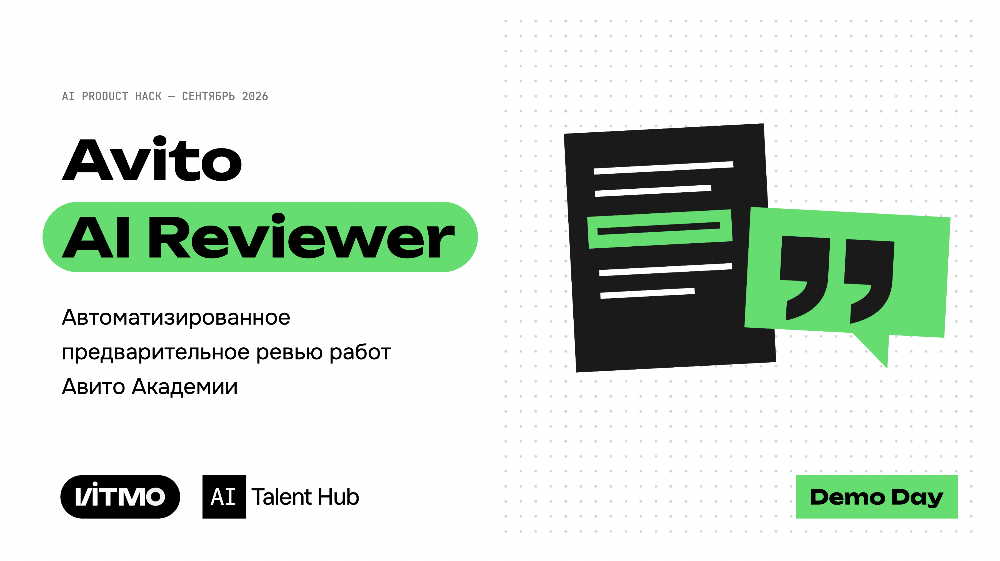
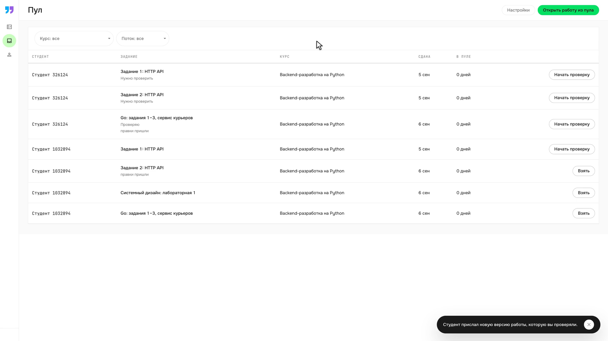
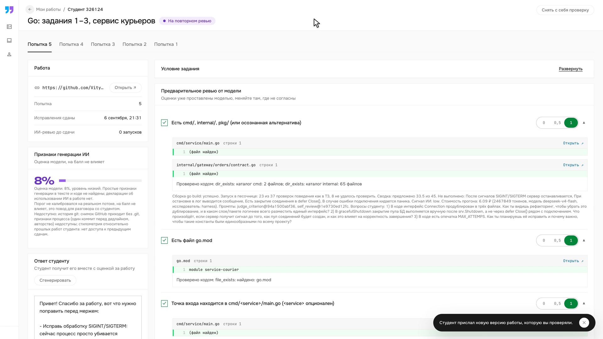
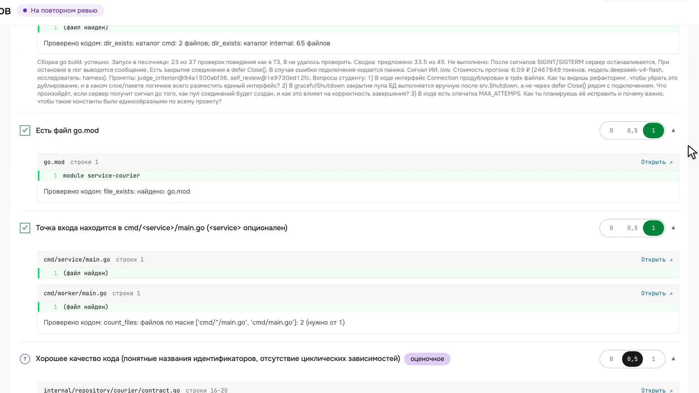
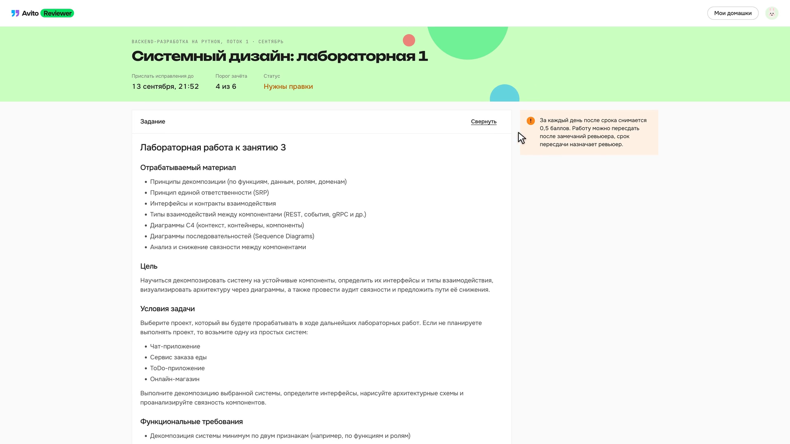
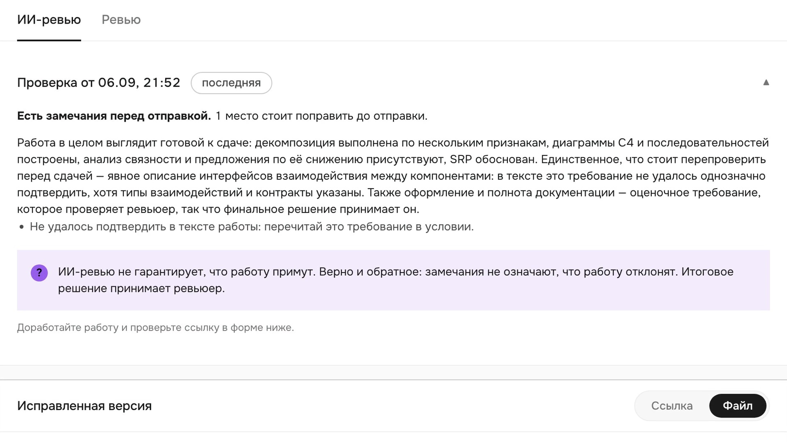
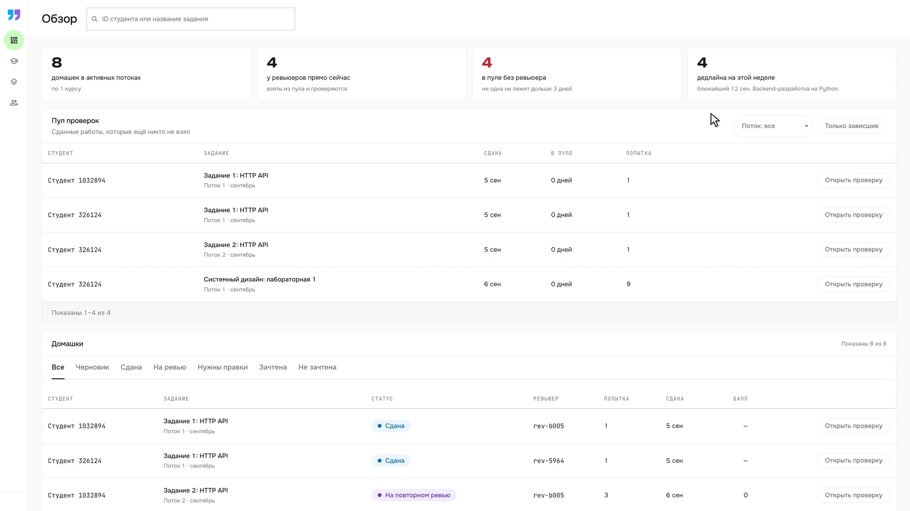
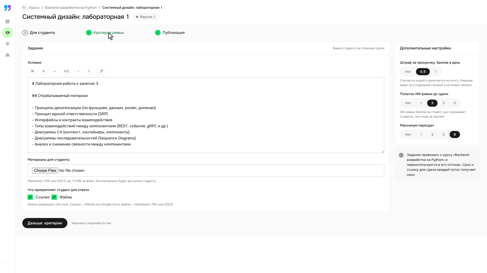

<h1 align="center">Avito AI Reviewer</h1>

<p align="center">
Проект хакатона <b>AI Product Hack 2026</b>, кейс Авито «AI Reviewer».
Платформа проверки домашних заданий с ИИ-помощником для ревьюера и координатора образовательных программ Авито. Модель готовит черновик проверки по каждому критерию, подтверждает каждый балл цитатой из работы, код проверяет, что цитата в работе есть, а решение всегда принимает человек.
</p>

<p align="center">
<a href="docs/defense/avito-ai-reviewer-defense.pptx">📊 Презентация (PPTX)</a> / <a href="docs/defense/avito-ai-reviewer-defense.key">📊 Презентация (Keynote)</a> / <a href="docs/demo/">🎬 Демо-ролики</a> / <a href="RUNNING.md">🚀 Запуск</a>
</p>

<p align="center">


</p>

<p align="center">

</p>

---

## В чём идея

У проверки домашних заданий сегодня нет единого состояния: работа лежит в GitHub или Stepik, критерии в условии, статус в Google Sheets, переписка в мессенджере. Ревьюер тратит около часа на работу, координатор до десяти часов в неделю на сверку и напоминания.

Мы не строим «оценщик работ», мы строим **слой управления проверкой**, в котором ИИ готовит черновик, а человек решает. Три правила, которые держит код:

1. **Каждый балл с цитатой, цитату проверяет код.** Модель обязана указать фрагмент работы с адресом «файл и строка». Не нашёл — балла нет, строка уходит ревьюеру с пометкой «нужен человек».
2. **Что можно проверить кодом — проверяется кодом.** Факт сборки `go build` и запуск в изолированной песочнице по сценариям из ТЗ курса значат больше, чем чтение кода моделью.
3. **Решение за человеком.** Система ничего не публикует и не ставит итоговую оценку. Сигнал об использовании ИИ живёт вне баллов.

## Как это выглядит

### Ревьюер

Ревьюер выбирает работу из пула — видит студента, задание, курс, сроки и статус.



Открывает карточку: оценки уже стоят, у каждой цитата из кода с номером строки, рядом факты сборки и запуска, сводка со стоимостью прогона. Слева — сигнал об ИИ (8%, уровень низкий) и черновик ответа студенту.



Прокручивает список критериев: формальные проверены кодом (зелёная галочка), содержательные моделью с цитатой, оценочные помечены и решаются человеком.



### Студент

Студентка открывает задание, видит условие, порог зачёта, штраф за просрочку и статус.



До сдачи запускает самопроверку — короткий итог без баллов и без сигнала об ИИ: только что стоит перепроверить по условию. Решение о зачёте принимает ревьюер.



### Координатор

Координатор видит обзор: сколько домашек в потоках, сколько у ревьюеров, сколько без ревьюера, дедлайны. Ниже — пул проверок и таблица всех работ с фильтрами по статусам.



Заводит задание один раз: условие в Markdown-редакторе, материалы для студента, настройки штрафа и лимит самопроверок. Дальше ревьюеры разбирают пул сами.



## Что внутри

| Компонент | Описание | Стек |
|---|---|---|
| [backend/](backend/) | Платформа: организация, курсы, пулы, штрафы, статистика, 103 эндпоинта, 12 MCP-инструментов, 73 таблицы, 663 теста | Python 3.13, FastAPI, SQLAlchemy, MySQL, Redis, MinIO |
| [prereview/](prereview/) | Сервис ИИ-проверки: снимок, защита данных, проверки кодом, судья по критерию, сигнал об ИИ, 34 теста | Python, FastAPI, DeepSeek v4 flash |
| [prereview/runner/](prereview/runner/) | Изолированная песочница без сети для безопасного запуска Go-кода | Python, Postgres 16, goose |
| [frontend/](frontend/) | Кабинеты студента, ревьюера и координатора, своя дизайн-система, 56 тестов | React 19, TypeScript, Vite |
| [prompts/](prompts/) | Восемь инструкций модели как версионируемые файлы, sha256 пишется в журнал прогона | Markdown |
| [deploy/](deploy/) | Compose-стек: платформа, сервис проверки, песочница | Docker Compose |

### Быстрый старт

Нужны Docker с Compose, Python 3.13 с `uv`, Node.js 22 и ключ LLM в `.env` (`DEEPSEEK_API_KEY=...`).

```bash
# Бэкенд, ИИ-сервис и песочница
docker compose -p workspace-completion-local \
  -f deploy/compose.yaml -f deploy/compose.workspace.yaml -f deploy/compose.ai.yaml \
  up --build -d --wait mysql redis minio sandbox-db runner ai api

# Фронтенд (в новом терминале)
npm ci --prefix frontend && BACKEND_URL=http://127.0.0.1:18000 npm --prefix frontend run dev
```

Полная инструкция и разбор ошибок: **[RUNNING.md](RUNNING.md)**.

## Ссылки

- **[final/](final/)** — материалы итоговой сдачи (описание проекта, архитектура, защита данных, экономика)
- **[docs/NUMBERS.md](docs/NUMBERS.md)** — все числа проекта: замеры качества, метрики, источники и допущения
- **[specs/](specs/README.md)** — функциональные и аналитические спецификации с контрактами
- **[docs/demo/](docs/demo/)** — ролики сквозного сценария: [ревьюер](docs/demo/reviewer-assist.mp4), [студент](docs/demo/student-self-review.mp4), [координатор](docs/demo/coordinator-overview.mp4)

## Команда

| Участник | Роль | Зона |
|---|---|---|
| Матвей Мелихов | AI Product | постановка, интервью, критерии успеха, дизайн-система и макеты, сценарий демо, презентация |
| Владимир Губин | AI Engineer | платформа: бэкенд, контракты, модель данных, фронтенд, массовый прогон корпуса |
| Илья Поддуба | AI Engineer | ядро ИИ-проверки, evals и калибровка, песочница, сигнал об ИИ, демо-ролики |
