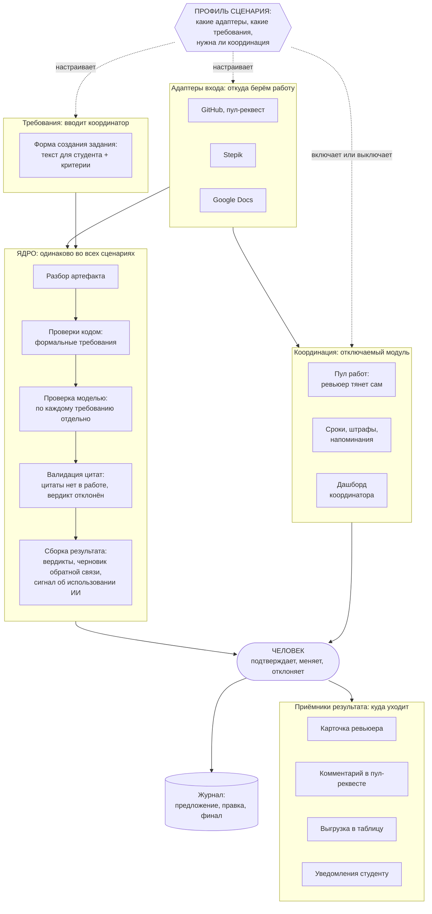

# Архитектура ядра

Извлечено из [03-platform.md](../../docs/03-platform.md), полное описание там.

Как читать: синий поток посередине — ядро, не меняется никогда. Слева и справа — адаптеры, меняются под сценарий. Координация сбоку — отключаемый модуль. Человек стоит между ядром и любым выходом, обойти нельзя.
