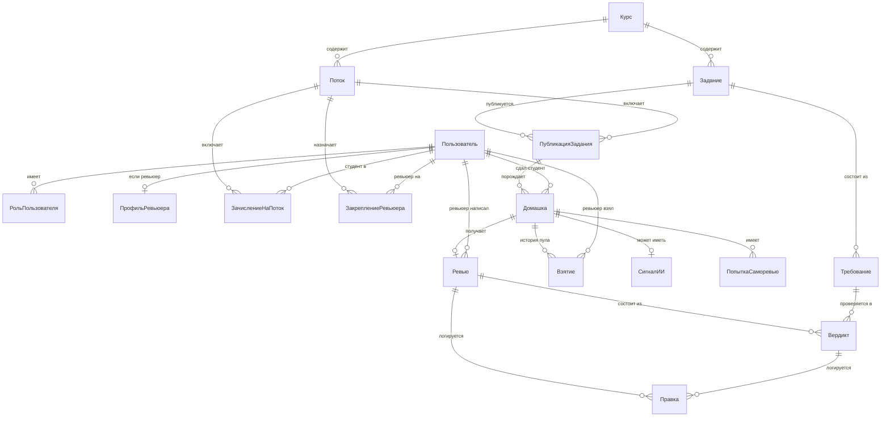

# Модель данных

16 сущностей, извлечено из [entities-and-screens.md](../../docs/platform-screens/entities-and-screens.md), полное описание с обоснованием каждой сущности там.

```mermaid
erDiagram
    Пользователь ||--o{ РольПользователя : имеет
    Пользователь ||--o| ПрофильРевьюера : "если ревьюер"
    Курс ||--o{ Задание : содержит
    Курс ||--o{ Поток : содержит
    Задание ||--o{ Требование : "состоит из"
    Задание ||--o{ ПубликацияЗадания : публикуется
    Поток ||--o{ ПубликацияЗадания : включает
    Поток ||--o{ ЗачислениеНаПоток : включает
    Пользователь ||--o{ ЗачислениеНаПоток : "студент в"
    Поток ||--o{ ЗакреплениеРевьюера : назначает
    Пользователь ||--o{ ЗакреплениеРевьюера : "ревьюер на"
    ПубликацияЗадания ||--o{ Домашка : порождает
    Пользователь ||--o{ Домашка : "сдал студент"
    Домашка ||--o{ Взятие : "история пула"
    Пользователь ||--o{ Взятие : "ревьюер взял"
    Домашка ||--o| СигналИИ : "может иметь"
    Домашка ||--o{ ПопыткаСаморевью : имеет
    Домашка ||--o| Ревью : получает
    Пользователь ||--o{ Ревью : "ревьюер написал"
    Ревью ||--o{ Вердикт : "состоит из"
    Требование ||--o{ Вердикт : "проверяется в"
    Ревью ||--o{ Правка : логируется
    Вердикт ||--o{ Правка : логируется
```
