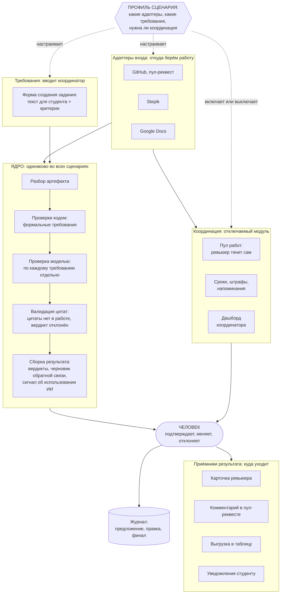

# 03. Какую платформу строим

## Одной фразой

**Движок проверки по требованиям с человеком в контуре.** На вход приходит артефакт и набор требований, на выходе ревьюер получает вердикт по каждому требованию с цитатой из работы и принимает решение. Проверка домашних заданий Авито — первый профиль этого движка, а не единственный.

## Почему не «единая платформа для студентов и ревьюеров»

Формулировка «единая платформа» читается как LMS, а LMS есть у всех: Stepik, Moodle, GitHub Classroom, внутренние решения. Продавать компании переезд с её платформы тяжело и не нужно.

Мы встаём слоем поверх того, что у компании уже есть. Работы остаются в GitHub, Stepik или Google Docs. Мы даём единое состояние процесса проверки, оценку по требованиям и аналитику, подключаемся адаптерами.

| Единая платформа обучения | Слой проверки |
|---|---|
| требует переезда, долгие продажи, сопротивление | подключается за день, ничего не ломает |
| конкурирует со Stepik и Moodle | дополняет их |
| ценность «всё в одном месте» | ценность «проверка перестала быть ручной» |

## Три уровня: ядро, профили, адаптеры

Это главный архитектурный принцип и главный ответ на вопрос про масштабирование.

Как читать схему:

- **синий поток посередине** это ядро, оно не меняется никогда,
- **слева и справа адаптеры**, они меняются под сценарий,
- **координация сбоку**, её можно выключить: при ревью кода в CI ревьюер уже назначен,
- **человек стоит между ядром и любым выходом**, обойти его нельзя,
- **профиль** это файл настроек, который говорит, какие адаптеры взять и нужна ли координация.

### Ядро, одинаковое во всех сценариях

1. Взять **артефакт**: текст, код, документ, таблицу.
2. Взять **свод требований**: критерии домашнего задания, стандарт оформления, чек-лист ревью, definition of done.
3. Разложить требования на три класса и проверить каждое подходящим способом.
4. Выдать **вердикт по каждому требованию с цитатой** из артефакта, цитату проверить кодом.
5. Отдать результат **человеку**, который подтверждает, меняет или отклоняет.
6. Записать в **журнал**: что предложила система, что изменил человек, каким стал финал.

Ничего из этих шести пунктов не зависит от того, домашка это или пул-реквест.

### Адаптеры, которые меняются под сценарий

| Адаптер | Что делает | Примеры |
|---|---|---|
| **Источник артефакта** | забирает или принимает то, что проверяем | два разных способа, см. ниже |
| **Источник требований** | форма, в которой координатор вводит требования сам | в MVP один способ: структурированная форма на платформе, без автоимпорта |
| **Проверки кодом** | считает то, что можно посчитать | число тест-кейсов, объём, линтер, компиляция, наличие разделов |
| **Приёмник результата** | куда уходит результат | наш интерфейс, комментарий в PR, выгрузка, задача в трекере |
| **Координация** | пул работ и заявленная ёмкость, сроки, напоминания. **Отключаемый модуль** | для домашек нужен, для CI не нужен, там ревьюер уже назначен |

### Два способа получить артефакт

Источник артефакта — не один тип адаптера, а два принципиально разных, и путать их нельзя.

**Забираем сами (pull-адаптер).** Годится только для GitHub. У пул-реквеста есть API, структура, история коммитов — есть что забирать и откуда. Ядро само приходит и читает.

**Принимаем на платформе (submission-адаптер).** Для Stepik и Google Docs забирать нечего — там нет API для произвольного набора файлов, который сдаёт студент. Вместо этого платформа сама становится местом сдачи для этого шага: в задании на Stepik стоит ссылка на страницу платформы, студент переходит по ней и прикрепляет артефакт там.

Это же решает регистрацию бесплатно. Ссылка несёт код конкретного потока и задания, студент приходит под своим Stepik ID — платформа по этому ID заводит пользователя, если его ещё нет, и сама привязывает к нужному потоку. Отдельного экрана «зарегистрируйтесь, затем найдите свой поток» не нужно — это происходит по переходу.

Экран прикрепления артефакта: [сущности и экраны](platform-screens/entities-and-screens.md#с0), макет — [platform-screens/all-screens.html#С1](platform-screens/all-screens.html#С1).

### Профили: сценарий как набор настроек

| Профиль | Артефакт | Требования | Кто решает | Координация |
|---|---|---|---|---|
| Домашка Авито, системный дизайн | Markdown в репозитории | таблица критериев из условия | ревьюер | нужна |
| Домашка Авито, Tech QA | таблица в Google Sheets | рубрика на 20 баллов из условия | ревьюер | нужна |
| Домашка другой компании | что угодно | своя рубрика | ревьюер | нужна |
| Ревью кода в CI | пул-реквест | стандарты команды, definition of done | автор и ревьюер | не нужна |
| Проверка документации на стандарт | документ | регламент оформления | техписатель | не нужна |
| Тестовое задание при найме | решение кандидата | критерии вакансии | эксперт | нужна |

**Что это значит на практике.** Смена сценария — это новый файл профиля и, если формат незнакомый, один адаптер. Ядро не трогается.

### Где здесь граница на хакатоне

Обобщать интерфейсы нужно, строить абстрактный движок «для всего» нельзя. Это ровно та ловушка, где кейсодатель перестаёт узнавать свою задачу.

- **В коде:** ядро с адаптерами, координация отключается флагом, второй профиль внутри образования (Tech QA, другой формат и другой канал). Это доказывает переносимость и стоит несколько часов.
- **На слайде:** ревью кода в CI, проверка документации на стандарты, тестовые задания при найме. Показываем таблицу профилей и говорим, что меняется только конфигурация.
- **Не делаем:** реальную интеграцию с CI, свою LMS, кабинет студента как полноценный интерфейс.

## Что в платформе есть

| Часть | Что делает | В MVP |
|---|---|---|
| Движок требований | требования как данные, версии, классы проверки | да |
| Проверки кодом | всё, что считается без модели | да |
| Проверка по требованиям моделью | вердикт и цитата по каждому пункту | да |
| Сигнал об использовании ИИ | признаки, уверенность, сверка с декларацией | да |
| Черновик обратной связи | текст студенту в тоне курса | да |
| Рабочее место ревьюера | вердикты, цитаты, подтверждение | да |
| Координация | пул работ (ревьюер тянет сам), сроки, статусы, напоминания | да |
| Рабочее место координатора | нагрузка, просрочки, исключения | да |
| Журнал решений | предложение системы, правка человека, финал | да |
| Саморевью для студента | проверка своей работы до сдачи | если успеем |
| Отчётность и аналитика | прогресс потока, типичные ошибки, согласованность ревьюеров | частично |
| Адаптеры источников | GitHub в MVP, остальные объявлены | один |
| Публичный API | подключение чужих платформ | описываем контракты |

## Что происходит с Google Sheets

Со слов кейсодателя таблица используется только для внутренней отчётности. Поэтому решение такое:

**Источник истины — платформа.** Балл, вердикты, статус, история правок живут у нас. Отчётность, которую сейчас ведут в таблице, платформа считает сама и показывает на дашборде.

**Выгрузка в Sheets остаётся как один из приёмников результата**, включается настройкой. Причины ровно три, все практические:

1. Кейс прямо называет перенос результатов в Google Sheets среди дополнительных функций. Жюри будет это искать.
2. Стоит один адаптер и полдня работы. Это самая дешёвая из всех дополнительных функций.
3. Внедрению не нужно ломать чужие привычки. Команда Авито может продолжать вести свою ведомость, пока не решит, что она больше не нужна.

Разница с текущим состоянием принципиальная. Сейчас Sheets — это место, где ревьюер вручную собирает результат, и оттуда данные приходится сверять с GitHub и Stepik. У нас Sheets — это выгрузка, которая формируется сама и никогда не является источником правды.

## Саморевью для студента

Студент прогоняет свою работу через тот же движок до того, как сдать её на проверку.

**Зачем это нам.** Меняется экономика всего процесса: меньше слабых работ на входе, меньше итераций доработки, меньше нагрузка на ревьюеров. Это единственная функция, которая одновременно полезна студенту, ревьюеру и координатору.

**Чем отличается от ревью для ревьюера.** Движок тот же, отличается ровно четыре вещи:

1. **Сигнал об использовании ИИ студенту не показывается вообще.** Иначе студент узнает, что его признаки видны, и просто уберёт их. Оценка использования ИИ остаётся работой ревьюера.
2. **Баллы не показываются.** Показывается список требований, которые пока не закрыты. Иначе саморевью превращается в торг за баллы.
3. **Число прогонов ограничено**, например тремя на одну работу. Иначе это перебор вариантов, а не самопроверка.
4. **Сохраняется снимок работы на момент каждого прогона.** Ревьюер потом видит, что студент менял после саморевью. Это частично закрывает риск маскировки: если после прогона из работы исчезли характерные признаки, это само по себе информация.

**Риск, уже подтверждённый на практике.** Это не гипотетическое опасение. Ревьюер Tech QA лично проверял: взял хорошо структурированное условие, скормил его модели как есть, сдал результат как студент — работа спокойно прошла проверку. Именно поэтому в реальном курсе критерии описывают намеренно неполно.

Это прямо бьёт по нашей идее саморевью: мы показываем студенту структурированные требования один в один, то есть даём ему готовый промпт для модели. Разбор риска и вариантов решения — в [08](08-review-core.md#риск-слишком-точные-критерии--это-уязвимость). Решение не выбрано, финализируем до того, как делать экран.

## Закрытый слой ревьюера

Саморевью полезно студенту само по себе. Но у него есть второй эффект, который важнее: оно **бесплатно порождает процессные данные, которых сегодня нет ни у кого**. Эти данные видит ревьюер и не видит студент.

Что попадает в закрытый слой:

| Что видит ревьюер | Откуда берётся | Зачем |
|---|---|---|
| Признаки использования ИИ с основаниями и уверенностью | разбор финальной версии работы | основной сигнал, требование кейса |
| Сколько раз студент запускал саморевью и когда | журнал саморевью | вовлечённость и добросовестность |
| Снимок работы на момент каждого прогона | сохраняем при каждом запуске | видно, какой работа была до правок |
| Что изменилось между прогонами и финальной сдачей | сравнение снимков | самое ценное, см. ниже |

**Почему сравнение снимков сильнее стилометрии.** Стилометрия угадывает по тексту и на русском языке работает средне. А вот наблюдаемый факт «на момент саморевью в работе были характерные признаки генерации, а в финальной версии их нет, при том что содержание не изменилось» — это не догадка, а зафиксированное поведение. Такой сигнал понятен ревьюеру без объяснений про модели и вероятности.

Обратный случай тоже полезен. Студент прогнал саморевью три раза, ни одного требования не закрыл и сдал как есть — это информация о том, что проблема не в непонимании требований.

**Правила закрытого слоя:**

1. Студент **знает, что саморевью логируется**. Мы не устраиваем скрытую слежку, в интерфейсе саморевью это написано прямо.
2. Студент **не видит содержимое слоя**: ни сигнала, ни того, какие именно признаки мы зафиксировали.
3. Слой открыт ревьюеру и координатору, закрыт для всех остальных.
4. Ничего из этого **не влияет на балл автоматически**. Это материал для решения человека, как и любой другой сигнал.

**Риск.** Узнав про логирование, часть студентов перестанет пользоваться саморевью. Принимаем осознанно: скрывать факт логирования хуже, чем потерять часть охвата. Для добросовестного студента ценность саморевью выше, чем неудобство от того, что оно записывается.

## Куда растём

Этапы роста и соседние сегменты вынесены в [07. Сквозной сценарий и куда растём](07-scenario-and-growth.md).

## Роли и что каждый получает

| Роль | Что получает | Насколько тщательно делаем интерфейс |
|---|---|---|
| **Ревьюер** | готовые вердикты с цитатами, черновик обратной связи, подтверждение в один клик | главный экран, делаем хорошо |
| **Координатор** | создание задания, статусы пула, просрочки, отчётность | дашборд, делаем функционально |
| **Студент** | обратная связь, статус, саморевью до сдачи | минимально, через существующие каналы |
| Руководитель программы | стоимость проверки, узкие места | отчёт, видение |

Ревьюер главный по качеству интерфейса, потому что его экран показывают на демо и именно он даёт обратную связь. Координатор главный по объёму снятой ручной работы, у него автоматизируется больше всего, но его интерфейс проще.

## Настоящий актив платформы

Не интерфейсы, их скопируют. Ценность накапливается в трёх вещах, которых нет ни в одной LMS:

1. **Пары «предложение системы, правка человека, финал»** — размеченные данные, растут с каждой проверкой.
2. **Библиотека сводов требований** по типам заданий — самая дорогая в подготовке часть.
3. **Статистика согласованности ревьюеров** — то, ради чего сейчас собирают калибровочные встречи.

Через полгода работы у компании появляется объективная картина того, как её эксперты оценивают. Сегодня этого нет ни у кого.

## Риски широкой рамки

| Риск | Что делаем |
|---|---|
| Кейсодатель не узнаёт свою проблему | демо строго на его сценарии, про профили говорим в конце |
| Ядро становится абстрактным и ничего не делает хорошо | обобщаем только интерфейсы, доказываем на втором профиле внутри образования |
| Скоуп расползается | в код идёт только то, что помечено «да» в таблице выше |
| «Платформа» звучит как LMS | всегда говорим «слой проверки поверх существующих систем» |
