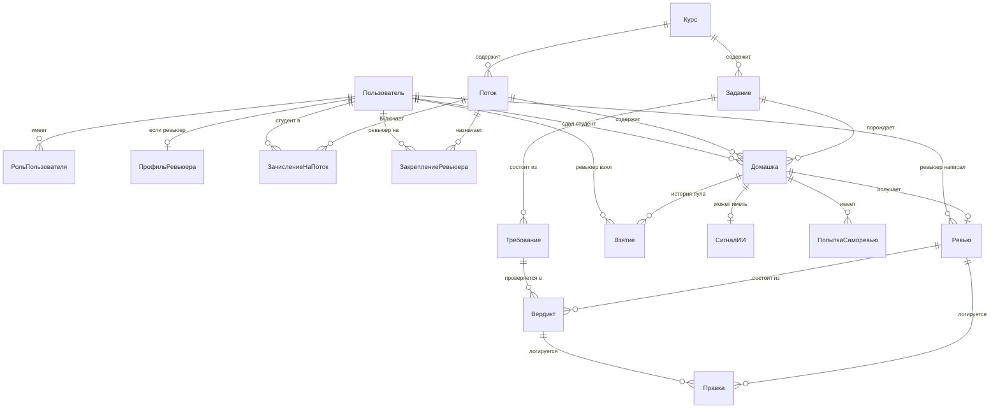

# 17. Сущности и полный реестр экранов

Это описание платформы целиком — не узкого сценария хакатона, а всего, из чего она должна состоять. Часть экранов уже есть в других документах в виде текста или макета, здесь они собраны в одном месте вместе с тем, чего раньше не было: аккаунт ревьюера, курсы и потоки, статистика.

В таблицах экранов колонка «Статус» показывает одно из трёх: **ядро MVP** — делаем на хакатоне, **видение** — не делаем сейчас, но входит в полную платформу, **смакетирован** — есть визуальный черновик, ссылка рядом.

Решения, которые я принял сам без уточнения, помечены пометкой «моё решение» с обоснованием — поправьте, если видите иначе.

---

## Сущности

### Список и что каждая означает

| Сущность | Что это | Зачем нужна отдельно от предложенного вами списка |
|---|---|---|
| **Пользователь** | человек в системе, идентифицируется по ID, не по ФИО | как в вашем списке |
| **Роль пользователя** | студент / ревьюер / координатор, привязана к пользователю | *моё решение:* вынес в отдельную сущность, а не поле, потому что один человек может быть одновременно ревьюером и координатором — так и есть у Авито, методист сам может ревьюить |
| **Профиль ревьюера** | расширение для роли «ревьюер»: темы/экспертиза, внутренний или внешний, периоды недоступности | нужно для pull-механики и для формы регистрации ревьюера, которую вы назвали первой |
| **Курс** | направление: Go, DS, системный дизайн | как в вашем списке |
| **Задание** | домашняя работа: текст для студента, срок, правило штрафа, эталонное решение. Принадлежит курсу, версионируется | как в вашем списке, плюс версия — по интервью критерии иногда правят прямо в середине потока |
| **Требование** | один пункт рубрики: формулировка, балл, класс проверки (формальное / содержательное / оценочное), способ проверки | *моё решение:* вынес из «Задания» в отдельную сущность — по интервью критерии обновляются независимо друг от друга, и у каждого свой способ проверки, свалить в одно текстовое поле нельзя |
| **Поток** | курс + дата начала + список студентов | как в вашем списке |
| **Зачисление на поток** | связка студент × поток | *моё решение:* отдельная сущность, а не поле в потоке — студент может быть зачислен на несколько потоков в истории |
| **Закрепление ревьюера** | связка ревьюер × поток (× тема), плюс заявленная ёмкость на этот период | нужно для pull: ёмкость не глобальная константа, а объявляется на конкретный поток |
| **Домашка** | сданное решение студента: ссылка на артефакт, статус, время сдачи, штраф | как в вашем списке |
| **Взятие** | факт, что ревьюер забрал домашку из пула, с возможностью вернуть | *моё решение:* нужно для истории пула — кто брал, когда вернул, иначе не построить дашборд координатора |
| **Сигнал об ИИ** | признаки использования ИИ по домашке: уверенность, основания, решение ревьюера подтвердить/отклонить | по контракту К2 не влияет на балл автоматически, поэтому не поле в «Ревью», а отдельная сущность со своим статусом |
| **Попытка саморевью** | один прогон самопроверки студентом: номер попытки, снимок работы, какие требования закрыты | нужна для закрытого слоя ревьюера — сравнение снимков до и после |
| **Ревью** | итоговая проверка домашки одним ревьюером: сумма баллов, текст обратной связи, время подтверждения | как в вашем списке |
| **Вердикт** | оценка одного требования внутри одного ревью: источник (код/модель/человек), значение, балл, цитата, что решил ревьюер | *моё решение:* вынес из «Ревью» — контракт И1 требует цитату на каждое утверждение, это должна быть строка, а не абзац текста |
| **Правка (журнал)** | запись «что предложила система → что изменил человек → когда» на любом из перечисленных объектов | контракт И5, обязателен для апелляций и как источник данных для калибровки |

### Как связаны

### Чего в модели пока нет намеренно

- **Организация / арендатор** — если платформа выйдет за пределы Авито, каждой компании понадобится свой контур. В модель не добавляю сейчас, но `Курс` спроектирован так, чтобы потом получить родителя `Организация` без переделки остального.
- **Уведомление** как сущность — пока это побочный эффект (отправили и забыли), не то, что нужно хранить и запрашивать историей. Если понадобится центр уведомлений — добавим.
- **Штраф** не отдельная сущность — это вычисляемое поле на `Домашке` по правилу из `Задания` и времени сдачи.

---

## Экраны

### Студент

| Экран | Что можно делать | Статус |
|---|---|---|
| Статус домашки | видит, на каком этапе проверка: сдана, взята ревьюером, проверена | видение |
| Саморевью | прогоняет работу до сдачи, видит незакрытые требования. Без баллов, без сигнала об ИИ | смакетирован — [screens.html, экран 5](screens.html) |
| Финальная обратная связь | читает итоговый разбор после подтверждения ревьюером | видение |

### Ревьюер

| Экран | Что можно делать | Статус |
|---|---|---|
| **Регистрация / создание аккаунта** | вводит тему специализации, внутренний или внешний статус, получает доступ | смакетирован — [accounts-and-stats.html](accounts-and-stats.html) |
| **Настройки профиля: доступность и темы** | отмечает периоды недоступности (отпуск), меняет темы, включает/выключает уведомления | смакетирован — там же |
| Кабинет: заявленная ёмкость и пул | указывает, сколько готов взять, получает работы из пула | смакетирован — [pull-flow.html](pull-flow.html) |
| Карточка работы | видит вердикты по каждому требованию с цитатами, подтверждает или правит, видит сигнал об ИИ, редактирует обратную связь | смакетирован — [screens.html, экран 1](screens.html) |
| **Личная статистика по ревью** | сколько проверил, среднее время, доля вердиктов модели, принятых без правок, расхождение с другими ревьюерами | смакетирован — [accounts-and-stats.html](accounts-and-stats.html) |
| Архив прошлых потоков | смотрит свои старые проверки | видение |

### Координатор

| Экран | Что можно делать | Статус |
|---|---|---|
| Список курсов | видит все направления, заходит в нужное | видение |
| **Создание курса** | название, канал сдачи по умолчанию | смакетирован — [accounts-and-stats.html](accounts-and-stats.html) |
| **Создание потока** | курс, дата начала, список студентов, закрепление ревьюеров по темам | смакетирован — там же |
| Создание задания | текст для студента, срок, правило штрафа | смакетирован — [pull-flow.html](pull-flow.html) |
| **Создание рубрики (требований)** | список требований с баллом, классом проверки, способом проверки, эталонное решение | смакетирован полнее — [accounts-and-stats.html](accounts-and-stats.html), черновик был в pull-flow.html |
| Состояние пула | сколько сдано, в пуле, взято, «горящие» работы без ревьюера | смакетирован — [pull-flow.html](pull-flow.html) |
| **Статистика по ревьюерам** | нагрузка, скорость, расхождение с моделью и друг с другом, кто отстаёт | смакетирован — [accounts-and-stats.html](accounts-and-stats.html) |
| Эскалации и спорные случаи | список работ на границе зачёта или с высоким сигналом об ИИ, ждущих второго взгляда | видение |
| Журнал решений по домашке | по одной работе видит цепочку «предложение → правка → финал» — для апелляций | видение |
| Настройка выгрузки | какие поля и куда уходят в Google Sheets | видение |

### Системные

| Экран | Что можно делать | Статус |
|---|---|---|
| Вход | стандартная аутентификация | видение |
| Профиль пользователя | общие настройки, смена роли, если применимо | видение |

---

## Что дальше

Все «видение»-экраны описаны только текстом здесь — этого достаточно для презентации архитектуры, но не для демо. В коде на хакатоне реализуются только «ядро MVP» из [05-scope.md](05-scope.md). Этот документ шире и описывает полную платформу, о которой мы рассказываем на защите.
