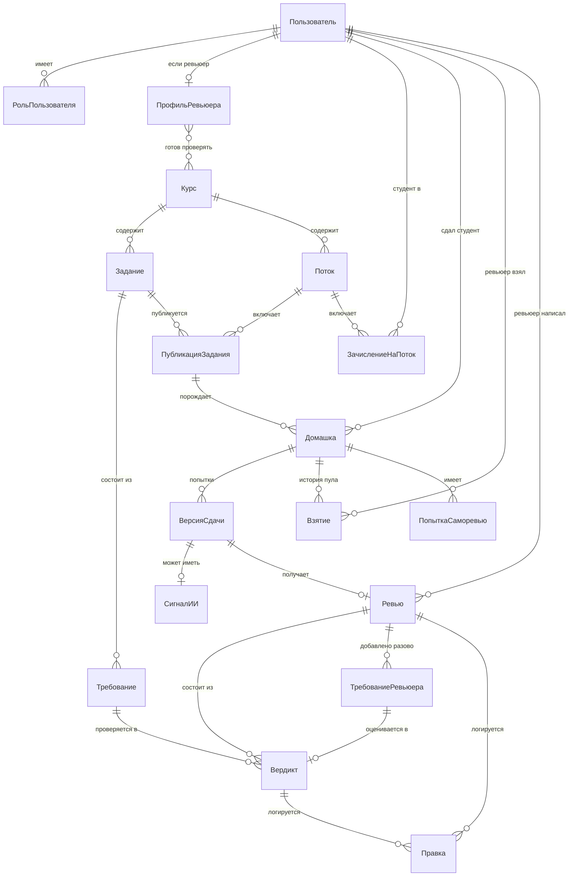

# Сущности и реестр экранов

Описание платформы целиком, а не узкого сценария хакатона: из каких сущностей она состоит и какие у неё экраны. Макеты — [screens.html](screens.html), статусы и переходы — [flows.md](flows.md). История правок этого документа в конце.

В таблицах экранов колонка «Статус» означает: **ядро MVP** — делаем на хакатоне, **видение** — не делаем сейчас, но входит в полную платформу, **смакетирован** — есть кадр в `screens.html`, **не делаем** и **не прорабатываем** — сознательно вынесено за рамки.

Решения, принятые без уточнения, помечены «моё решение» с обоснованием.

---

## Сущности

### Список и что каждая означает

| Сущность | Что это | Зачем нужна отдельно от предложенного вами списка |
|---|---|---|
| **Пользователь** | человек в системе, идентифицируется по ID, не по ФИО. Несёт один или несколько **внешних идентификаторов** (Stepik ID, GitHub-логин) — по ним узнаём человека при заходе извне | как в вашем списке, плюс внешние идентификаторы — без них не работает автовход по ссылке из Stepik |
| **Роль пользователя** | студент / ревьюер / координатор, привязана к пользователю | *моё решение:* вынес в отдельную сущность, а не поле, потому что один человек может быть одновременно ревьюером и координатором — так и есть у Авито, методист сам может ревьюить |
| **Профиль ревьюера** | расширение для роли «ревьюер»: курсы, которые готов проверять, доступность и период отсутствия | нужно для pull-механики. Курсы, а не темы: ревьюер выбирает курс целиком, отдельной сущности «тема» в модели нет |
| **Курс** | направление: Go, DS, системный дизайн | как в вашем списке |
| **Задание** | шаблон домашней работы: текст для студента, формат сдачи, правило штрафа, число попыток саморевью, порог зачёта, рекомендации ревьюерам, эталонное решение. Принадлежит курсу, версионируется | как в вашем списке. Рекомендации ревьюерам — то, что раньше передавалось голосом на калибровочной встрече, поэтому поле задания, а не переписка |
| **Требование** | один пункт рубрики: формулировка, описание «что считается выполненным», **шкала** (набор допустимых значений, например 0 и 1 или 0, 0.5 и 1), класс проверки (формальное / содержательное / оценочное) | *моё решение:* вынес из «Задания». Шкала именно набор значений, а не максимальный балл: ревьюер выбирает из неё, свободного ввода балла нет |
| **Требование ревьюера** | требование, добавленное ревьюером в рамках одной конкретной проверки: формулировка, шкала, может быть без баллов | *новое.* Принадлежит ревью, а не заданию: это разовое замечание по этой работе, оно не появляется у других студентов и не меняет рубрику задания |
| **Поток** | курс, даты начала и окончания, ID, собранный из курса и дат | уточнено: списка студентов в потоке нет, зачисление отдельной сущностью и происходит само |
| **Публикация задания** | связка задание (версия) × поток: срок сдачи именно в этом потоке и **код сдачи** — токен, зашитый в ссылку, которую координатор вставляет в Stepik | Задание переиспользуется в разных потоках с разными сроками. Без этой связки негде хранить ни срок конкретного потока, ни ссылку, по которой студент попадает на платформу |
| **Зачисление на поток** | связка студент × поток | *моё решение:* отдельная сущность, а не поле в потоке — студент может быть зачислен на несколько потоков в истории. Создаётся автоматически при первом переходе по ссылке с ещё не встречавшимся Stepik ID |
| **Домашка** | всё, что студент делает по одной публикации задания: текущий статус из семи (см. [flows.md](flows.md)), номер текущей попытки, штраф. Ссылается на публикацию задания, а не на задание напрямую | уточнено: домашка живёт от первого перехода по ссылке до закрытия и переживает несколько попыток, поэтому сам артефакт вынесен в «Версию сдачи» |
| **Версия сдачи** | одна попытка: артефакт (ссылка на репозиторий или файлы), комментарий студента, время отправки, номер попытки | *новое.* На экранах у студента и координатора попытки разложены вкладками, у каждой свои оценки. Без отдельной сущности некуда положить вторую версию работы и её ревью |
| **Взятие** | факт, что ревьюер забрал домашку из общего пула: кто, когда взял, когда вернул. Пока взятие открыто, домашка закреплена за этим ревьюером и в пуле не показывается | *моё решение:* нужно для истории пула. **Создаётся атомарно:** на домашку может существовать только одно открытое взятие, второй ревьюер, нажавший «Взять» одновременно, получает отказ «уже взята». Возврат в пул закрывает взятие, домашка снова становится свободной, и новое взятие может открыть кто угодно |
| **Сигнал об ИИ** | признаки использования ИИ по версии сдачи: вероятность в процентах, перечень признаков, решение ревьюера | по контракту К2 не влияет на балл автоматически, поэтому не поле в «Ревью», а отдельная сущность со своим статусом |
| **Попытка саморевью** | один прогон самопроверки студентом: номер попытки, снимок артефакта на этот момент, какие требования закрыты | нужна студенту, чтобы видеть незакрытые требования, и ревьюеру в закрытом слое для сравнения снимков до и после, см. [03-platform.md](../03-platform.md) |
| **Ревью** | проверка одной версии сдачи одним ревьюером: сумма баллов, текст обратной связи, время подтверждения | уточнено: привязано к версии, а не к домашке. У домашки с двумя попытками два ревью |
| **Вердикт** | оценка одного требования внутри одного ревью: источник (модель или человек), выбранное значение шкалы, цитата, что изменил ревьюер | *моё решение:* вынес из «Ревью» — контракт И1 требует цитату на каждое утверждение, это должна быть строка, а не абзац текста |
| **Правка (журнал)** | запись «что предложила система → что изменил человек → когда» на любом из перечисленных объектов | контракт И5, обязателен для апелляций и как источник данных для калибровки |

### Как связаны

### Как это выглядит на практике: вход через Stepik

Координатор публикует задание в потоке → система создаёт **Публикацию задания** с уникальным кодом сдачи → координатор копирует ссылку вида `platform.avito.edu/s/<код>` и вставляет её в шаг задания на Stepik.

Студент в Stepik видит условие и эту ссылку. Переходит по ней вместе со своим Stepik ID (передаётся автоматически, это стандартная механика внешних ссылок в Stepik). Дальше без единого экрана регистрации:

1. Код в ссылке резолвится в конкретную Публикацию задания → известны Поток и Задание.
2. Ищем Пользователя по Stepik ID. Не нашли — создаём, ID платформы генерируется, ФИО не запрашиваем.
3. Ищем Зачисление на поток для этого пользователя и потока. Не нашли — создаём.
4. Показываем экран прикрепления артефакта, уже зная, кто пришёл и по какому заданию.

Отдельной формы «зарегистрируйтесь» для студента нет вообще — регистрация это побочный эффект первого перехода по ссылке.

### Чего в модели пока нет намеренно

- **Организация / арендатор** — если платформа выйдет за пределы Авито, каждой компании понадобится свой контур. В модель не добавляю сейчас, но `Курс` спроектирован так, чтобы потом получить родителя `Организация` без переделки остального.
- **Уведомление** как сущность — пока это побочный эффект (отправили и забыли), не то, что нужно хранить и запрашивать историей. Если понадобится центр уведомлений — добавим.
- **Штраф** не отдельная сущность — это вычисляемое поле на `Домашке` по правилу из `Задания` и времени сдачи.
- **Квота или ёмкость ревьюера** — сущности нет и не будет. Ревьюер берёт работы из общего пула вручную, ограничений по числу активных работ нет, поэтому хранить нечего.
- **Тема или экспертиза** отдельно от курса. Ревьюер выбирает курсы целиком, промежуточного уровня «тема» нет ни на одном экране.

### Видимость саморевью, решение принято

**Результат саморевью видит ревьюер и учитывает при оценке.** Закрытого слоя больше нет: студент знает из экранов С1 и С2, что число запусков и результат видны ревьюеру. Самореview это механизм ускорения проверки, а не тихая подгонка: ревьюер опирается на него как на добросовестность студента. Снимок работы на каждый прогон сохраняется, сравнение снимков показывает, что студент правил.

---

## Экраны

Макеты — [screens.html](screens.html), там же коды экранов. Логика переходов и таблица «функция, экран, переход» — в [flows.md](flows.md).

### Студент

| Экран | Что можно делать | Статус |
|---|---|---|
| **Страница домашки по ссылке**  | переходит по ссылке из Stepik, система узнаёт его и поток автоматически, прикрепляет работу ссылкой на репозиторий или файлами, гоняет саморевью, отправляет на ревью, после возврата присылает правки | **ядро MVP**. Смакетирована в трёх состояниях — [С1](screens.html#С1), [С2](screens.html#С2), [С3](screens.html#С3) |
| Саморевью | прогоняет работу до сдачи, видит закрытые и незакрытые требования. Без баллов, без сигнала об ИИ | не отдельный экран, состояние страницы сдачи — [С2](screens.html#С2) |
| Мои домашки | список всех домашек по всем курсам со статусами, точка входа в кабинет | смакетирован — [С4](screens.html#С4) |
| Домашка в кабинете | разбор по требованиям, комментарий ревьюера, история попыток и событий | смакетирован — [С5](screens.html#С5) |

Отдельных экранов «статус домашки» и «финальная обратная связь» нет: статус — это плашка на карточке домашки, итог — тот же разбор в закрытом состоянии.

### Ревьюер

| Экран | Что можно делать | Статус |
|---|---|---|
| **Вход** | входит через Avito ID, аккаунт создаётся при первом входе | смакетирован — [Р1](screens.html#Р1) |
| **Мои активные и общий пул** | видит закреплённые за собой работы и все свободные, берёт любую кнопкой «Взять», возвращает в пул. Пул отсортирован по дате сдачи, горящие подсвечены | смакетирован — [Р2](screens.html#Р2) |
| **Настройки** | выбирает курсы, которые готов проверять, отмечает отпуск. Квоты нет | смакетирован — [Р3](screens.html#Р3) |
| **Статистика** | сколько проверил, среднее время, где чаще правит модель, расхождение с коллегами | вкладка кабинета, не отдельный раздел — [Р4](screens.html#Р4) |
| Карточка работы | видит разбор от модели по требованиям с цитатами, меняет оценку по шкале из задания, добавляет своё требование с оценкой, решает по признакам ИИ, правит ответ студенту | смакетирована — [Р5](screens.html#Р5) |
| **Карточка работы, повторная проверка** | попытки разложены вкладками, прошлая доступна целиком и только для чтения. Признаки генерации ИИ считаются заново для новой версии | смакетирована — [Р6](screens.html#Р6) |
| Сравнение версий рядом | две версии работы в двух колонках с подсветкой различий | видение, к MVP не нужно: хватает вкладок и карточки прошлых замечаний |
| Архив прошлых потоков | смотрит свои старые проверки | видение |
| Управление составом ревьюеров | доступ выдаётся входом через Avito ID, экрана одобрения нет | не делаем |
| Внешние эксперты | вход, одобрение, отдельные права | не прорабатываем |

### Координатор

| Экран | Что можно делать | Статус |
|---|---|---|
| Обзор | все потоки с состоянием, фильтры по курсу и статусу в шапке таблицы, что требует внимания, ближайшие дедлайны | смакетирован — [К1](screens.html#К1) |
| Поиск | по ID студента и названию задания, результаты сгруппированы по типу, строка ведёт в работу или в карточку задания. По ФИО не ищем, его в системе нет | смакетирован — [К1а](screens.html#К1а) |
| Курсы | справочник курсов: название, описание, число заданий и потоков, необязательная ссылка на курс в Stepik. Клик по строке открывает то же окно, что и создание курса. Отдельной карточки курса нет | смакетирован — [К2](screens.html#К2) |
| **Создание курса** | название, описание, необязательная ссылка на курс в Stepik, кто ведёт | модальное окно, не экран — [К3](screens.html#К3) |
| **Создание потока** | курс, даты, ID генерируется из курса и дат | модальное окно, не экран — [К4](screens.html#К4) |
| Задание, шаг 1 | условие для студента, формат сдачи, срок, штраф за день просрочки (нет, 0,5 или 1 балл), попытки саморевью (нет, 1, 3 или 5) | смакетирован — [К5](screens.html#К5) |
| Задание, шаг 2 | критерии: формулировка, «выполнено, если», класс проверки, баллы и шаг. Шкала не задаётся, она считается из баллов и шага. Рекомендации ревьюерам, эталонное решение, порог зачёта, версии. Формат файла — в [08-review-core](../08-review-core.md) | смакетирован — [К6](screens.html#К6) |
| **Публикация задания в потоке и ссылка для Stepik** | привязывает задание к потоку, задаёт срок именно для него, получает ссылку с кодом сдачи | **ядро MVP**, шаг 3 того же мастера, не смакетирован |
| Пул проверок | что сдано и не взято, кто зависает, типичные ошибки потока с возможностью добавить их в описание курса | смакетирован — [К7](screens.html#К7) |
| Реестр домашек | все статусы по курсу и потоку, поиск, вкладки по состояниям, вход в любое ревью | смакетирован — [К8](screens.html#К8) |
| Просмотр ревью | тот же экран, что у ревьюера, только для чтения, плюс история решений по работе | смакетирован — [К9](screens.html#К9) |
| Выгрузка | вручную после дедлайна, выбор колонок и формата, скачивание файла. Два варианта: внутренняя ведомость и копия без ПДн для студентов | модальное окно — [К10](screens.html#К10) |
| Принудительное назначение работ | раздать зависшие работы руками | убрано осознанно, см. открытый вопрос в [flows.md](flows.md) |
| Статистика по ревьюерам, эскалации, журнал решений | отдельные разделы админки | видение, отдельных экранов пока нет. Журнал решений виден внутри [К9](screens.html#К9) |

### Системные

| Экран | Что можно делать | Статус |
|---|---|---|
| Профиль пользователя | общие настройки, смена роли, если применимо | видение |

---

## Что дальше

Все «видение»-экраны описаны только текстом здесь — этого достаточно для презентации архитектуры, но не для демо. В коде на хакатоне реализуются только «ядро MVP» из [05-scope.md](../05-scope.md). Этот документ шире и описывает полную платформу, о которой мы рассказываем на защите.

---

## История правок

1. **Первый проход.** Не хватало экрана прикрепления артефакта студентом и всего, что за ним стоит: вход через Stepik ID, автопривязка к потоку, ссылка на сдачу для вставки в Stepik. Добавлено, задело модель данных.
2. **Второй проход.** По черновику списка экранов добавлены регистрация ревьюера, распределение хвостов после срока, управление составом ревьюеров, реестр домашек, просмотр завершённых ревью.
3. **Третий проход.** Макеты лежали в четырёх отдельных файлах, сведены в один, старые удалены. Нашлись два экрана, тихо противоречивших более поздним решениям: раскладка координатором и автоизвлечение критериев из готового условия.
4. **Четвёртый проход.** Ограничение нагрузки ревьюера стало квотой в штуках вместо дат. Убраны канал сдачи из создания курса, список студентов и состав ревьюеров из создания потока. Экран «Рубрика» убран, эталон и порог зачёта переехали в задание.
5. **Пятый проход.** Макеты переписаны заново в [screens.html](screens.html), каждый экран кадром 1920 на 1080 с постоянным меню. Сдача, саморевью и результат сведены в одну страницу по ссылке, у студента появился кабинет. Квота задаётся на спринт числом от минимума до 100. Карточка работы показывает один разбор от модели и позволяет добавлять свои требования с оценкой. Создание курса и потока стали модальными окнами, задание заполняется по шагам, выгрузка вручную. Появились семь статусов домашки и [flows.md](flows.md).
6. **Шестой проход.** Модель данных догнала макеты: «Закрепление ревьюера» заменено «Квотой ревьюера» на спринт, добавлены «Версия сдачи» и «Требование ревьюера», ревью привязано к версии, а не к домашке. У требования появилась шкала и описание «что считается выполненным», у задания — рекомендации ревьюерам и порог зачёта. Убраны темы как отдельный уровень. Зафиксировано расхождение про видимость саморевью.
7. **Седьмой проход.** Отказались от автораспределения и квот совсем. Сущность «Квота ревьюера» удалена, у «Взятия» описаны атомарность и возврат в пул. На Р2 появились «Мои активные» и «Общий пул» с кнопками «Взять» и «Вернуть в пул», на Р3 остались только курсы и отпуск, на К7 убрано расширение круга ревьюеров. Вопрос гарантии покрытия пула закрыт решением не давать её механизмом, см. [flows.md](flows.md).
