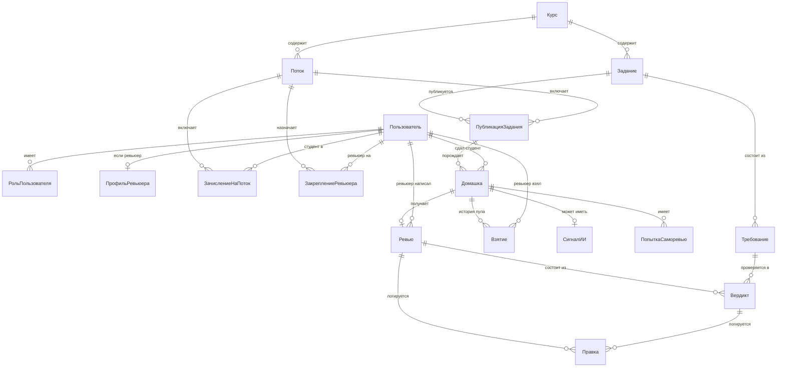

# 17. Сущности и полный реестр экранов

Это описание платформы целиком — не узкого сценария хакатона, а всего, из чего она должна состоять. Часть экранов уже есть в других документах в виде текста или макета, здесь они собраны в одном месте вместе с тем, чего раньше не было: аккаунт ревьюера, курсы и потоки, статистика, вход и сдача работы студентом.

В таблицах экранов колонка «Статус» показывает одно из трёх: **ядро MVP** — делаем на хакатоне, **видение** — не делаем сейчас, но входит в полную платформу, **смакетирован** — есть визуальный черновик, ссылка рядом.

Решения, которые я принял сам без уточнения, помечены пометкой «моё решение» с обоснованием — поправьте, если видите иначе.

**Правка после первого прохода:** не хватало экрана прикрепления артефакта студентом и всего, что за ним стоит — вход через Stepik ID, автопривязка к потоку, ссылка на сдачу, которую координатор вставляет в Stepik. Добавлено ниже, задело и модель данных.

**Правка после второго прохода:** по своему черновику списка экранов добавили ещё пять — регистрацию ревьюера через Avito ID отдельно от внешних экспертов, аварийное распределение хвостов после срока, управление составом ревьюеров, полный реестр домашек и просмотр завершённых ревью. Плюс на карточке работы у ревьюера появилась возможность добавить своё замечание, не привязанное ни к одному требованию.

**Правка после третьего прохода:** макеты лежали в четырёх отдельных файлах, появившихся в разные моменты разговора, — пришлось прыгать между ссылками, чтобы увидеть всё сразу. Собраны в один файл, [all-screens.html](all-screens.html), с единой навигацией, а старые четыре файла удалены. По ходу сборки нашлись два экрана из первой версии, которые тихо противоречили более поздним решениям — раскладка координатором и автоизвлечение критериев из готового условия — они исправлены в общем файле, а не скопированы как были. Все ссылки на смакетированные экраны ниже ведут на якоря внутри `all-screens.html`.

**Правка после четвёртого прохода:** макеты доведены до вида, близкого к реальному интерфейсу — каждый экран занимает стандартный десктопный размер, а не произвольную высоту под контент. Заодно поменялась сама платформа в нескольких местах.

Доступность ревьюера теперь показывает системную рекомендацию. Ограничение по нагрузке задаётся квотой в штуках, а не датами. На карточке работы ревьюер либо принимает вердикт модели, либо меняет оценку по шкале из настроек задания, отдельного «отклонить» по пункту больше нет, зато появилось массовое принятие или отклонение сразу по всем пунктам. Создание курса больше не спрашивает канал сдачи. Создание потока не просит список студентов и состав ревьюеров, вместо этого координатор задаёт ID потока, а зачисление студентов идёт автоматически по ссылке и Stepik ID, как и раньше было устроено на экране сдачи.

Экран «Рубрика» убран, эталонное решение и порог зачёта переехали в экран создания задания. Экраны «Управление ревьюерами», «Статистика по ревьюерам», «Эскалации и спорные случаи», «Журнал решений по домашке» убраны из макета — как концепции они остаются в реестре ниже статусом «видение», без визуального черновика. Итог — 18 экранов вместо 23. Все статусы и ссылки в таблицах ниже приведены в соответствие.

---

## Сущности

### Список и что каждая означает

| Сущность | Что это | Зачем нужна отдельно от предложенного вами списка |
|---|---|---|
| **Пользователь** | человек в системе, идентифицируется по ID, не по ФИО. Несёт один или несколько **внешних идентификаторов** (Stepik ID, GitHub-логин) — по ним узнаём человека при заходе извне | как в вашем списке, плюс внешние идентификаторы — без них не работает автовход по ссылке из Stepik |
| **Роль пользователя** | студент / ревьюер / координатор, привязана к пользователю | *моё решение:* вынес в отдельную сущность, а не поле, потому что один человек может быть одновременно ревьюером и координатором — так и есть у Авито, методист сам может ревьюить |
| **Профиль ревьюера** | расширение для роли «ревьюер»: темы/экспертиза, внутренний или внешний, периоды недоступности | нужно для pull-механики и для формы регистрации ревьюера |
| **Курс** | направление: Go, DS, системный дизайн | как в вашем списке |
| **Задание** | шаблон домашней работы: текст для студента, правило штрафа, эталонное решение. Принадлежит курсу, версионируется | как в вашем списке, плюс версия — по интервью критерии иногда правят прямо в середине потока |
| **Требование** | один пункт рубрики: формулировка, балл, класс проверки (формальное / содержательное / оценочное), способ проверки | *моё решение:* вынес из «Задания» в отдельную сущность — по интервью критерии обновляются независимо друг от друга, и у каждого свой способ проверки, свалить в одно текстовое поле нельзя |
| **Поток** | курс + дата начала + список студентов | как в вашем списке |
| **Публикация задания** | связка задание (версия) × поток: срок сдачи именно в этом потоке и **код сдачи** — токен, зашитый в ссылку, которую координатор вставляет в Stepik | *новое, добавлено сейчас.* Задание — шаблон и переиспользуется в разных потоках с разными сроками. Без этой связки негде хранить ни срок конкретного потока, ни ссылку, по которой студент попадает на платформу |
| **Зачисление на поток** | связка студент × поток | *моё решение:* отдельная сущность, а не поле в потоке — студент может быть зачислен на несколько потоков в истории. Создаётся автоматически при первом переходе по ссылке с ещё не встречавшимся Stepik ID |
| **Закрепление ревьюера** | связка ревьюер × поток (× тема), плюс заявленная ёмкость на этот период | нужно для pull: ёмкость не глобальная константа, а объявляется на конкретный поток |
| **Домашка** | сданное решение студента: артефакт (файлы, ссылки, текст — зависит от задания), статус, время сдачи, штраф. Ссылается на публикацию задания, а не на задание напрямую | как в вашем списке, уточнено — привязана к конкретному потоку через публикацию |
| **Взятие** | факт, что ревьюер забрал домашку из пула, с возможностью вернуть | *моё решение:* нужно для истории пула — кто брал, когда вернул, иначе не построить дашборд координатора |
| **Сигнал об ИИ** | признаки использования ИИ по домашке: уверенность, основания, решение ревьюера подтвердить/отклонить | по контракту К2 не влияет на балл автоматически, поэтому не поле в «Ревью», а отдельная сущность со своим статусом |
| **Попытка саморевью** | один прогон самопроверки студентом: номер попытки, снимок артефакта на этот момент, какие требования закрыты | нужна для закрытого слоя ревьюера — сравнение снимков до и после |
| **Ревью** | итоговая проверка домашки одним ревьюером: сумма баллов, текст обратной связи, время подтверждения | как в вашем списке |
| **Вердикт** | оценка одного требования внутри одного ревью: источник (код/модель/человек), значение, балл, цитата, что решил ревьюер | *моё решение:* вынес из «Ревью» — контракт И1 требует цитату на каждое утверждение, это должна быть строка, а не абзац текста |
| **Правка (журнал)** | запись «что предложила система → что изменил человек → когда» на любом из перечисленных объектов | контракт И5, обязателен для апелляций и как источник данных для калибровки |

### Как связаны

### Как это выглядит на практике: вход через Stepik

Координатор публикует задание в потоке → система создаёт **Публикацию задания** с уникальным кодом сдачи → координатор копирует ссылку вида `platform.avito.edu/s/<код>` и вставляет её в шаг задания на Stepik.

Студент в Stepik видит условие и эту ссылку. Переходит по ней вместе со своим Stepik ID (передаётся автоматически, это стандартная механика внешних ссылок в Stepik). Дальше без единого экрана регистрации:

1. Код в ссылке резолвится в конкретную Публикацию задания → известны Поток и Задание.
2. Ищем Пользователя по Stepik ID. Не нашли — создаём, ID платформы генерируется, ФИО не запрашиваем.
3. Ищем Зачисление на поток для этого пользователя и потока. Не нашли — создаём.
4. Показываем экран прикрепления артефакта, уже зная, кто пришёл и по какому заданию.

Отдельной формы «зарегистрируйтесь» для студента нет вообще — регистрация это побочный эффект первого перехода по ссылке.

### Чего в модели пока нет намеренно

- **Организация / арендатор** — если платформа выйдет за пределы Авито, каждой компании понадобится свой контур. В модель не добавляю сейчас, но `Курс` спроектирован так, чтобы потом получить родителя `Организация` без переделки остального.
- **Уведомление** как сущность — пока это побочный эффект (отправили и забыли), не то, что нужно хранить и запрашивать историей. Если понадобится центр уведомлений — добавим.
- **Штраф** не отдельная сущность — это вычисляемое поле на `Домашке` по правилу из `Задания` и времени сдачи.

---

## Экраны

### Студент

| Экран | Что можно делать | Статус |
|---|---|---|
| **Прикрепление артефакта**  | переходит по ссылке из Stepik, система узнаёт его и поток автоматически, прикрепляет файлы или ссылки, отправляет | **ядро MVP** — без этого не работает Stepik-канал. Смакетирован — [all-screens.html#С1](all-screens.html#С1) |
| Саморевью | прогоняет работу до сдачи, видит незакрытые требования. Без баллов, без сигнала об ИИ | смакетирован — [all-screens.html#С3](all-screens.html#С3) |
| **Повторная сдача после доработки** | видит прошлые замечания, прикрепляет новую версию | смакетирован как состояние того же экрана — [all-screens.html#С2](all-screens.html#С2) |
| Статус домашки | видит, на каком этапе проверка: сдана, взята ревьюером, проверена | смакетирован — [all-screens.html#С4](all-screens.html#С4) |
| Финальная обратная связь | читает итоговый разбор после подтверждения ревьюером | смакетирован — [all-screens.html#С5](all-screens.html#С5) |

### Ревьюер

| Экран | Что можно делать | Статус |
|---|---|---|
| **Регистрация — два пути** | внутренний сотрудник входит по Avito ID и получает доступ сразу, внешний эксперт заполняет форму и ждёт одобрения координатора | смакетирован — [all-screens.html#Р1](all-screens.html#Р1) |
| **Настройки профиля: доступность и курсы** | отмечает периоды недоступности, видит рекомендованную доступность от системы, задаёт квоту работ, меняет курсы, включает/выключает уведомления | смакетирован — [all-screens.html#Р2](all-screens.html#Р2) |
| Кабинет: заявленная ёмкость и пул | указывает, сколько готов взять, получает работы из пула | смакетирован — [all-screens.html#Р3](all-screens.html#Р3) |
| Карточка работы | видит вердикты по каждому требованию с цитатами, подтверждает или правит, видит сигнал об ИИ, редактирует обратную связь, может добавить своё замечание сверх списка требований | смакетирован — [all-screens.html#Р4](all-screens.html#Р4) |
| **Карточка работы — режим сравнения версий** | при повторной проверке видит прошлые замечания рядом с новой версией, что закрыто, что нет | видение, состояние карточки работы, отдельного экрана не требует |
| **Личная статистика по ревью** | сколько проверил, среднее время, доля вердиктов модели, принятых без правок, расхождение с другими ревьюерами | смакетирован — [all-screens.html#Р5](all-screens.html#Р5) |
| Архив прошлых потоков | смотрит свои старые проверки | видение |

### Координатор

| Экран | Что можно делать | Статус |
|---|---|---|
| Обзор курсов и дедлайнов | видит все направления и ближайшие сроки, заходит в нужный | смакетирован — [all-screens.html#К1](all-screens.html#К1) |
| **Создание курса** | название | смакетирован — [all-screens.html#К2](all-screens.html#К2) |
| **Создание потока** | курс, дата начала, дата окончания, ID потока | смакетирован — [all-screens.html#К3](all-screens.html#К3) |
| Создание задания | текст для студента, срок, критерии, эталонное решение, порог зачёта, правило штрафа | смакетирован — [all-screens.html#К4](all-screens.html#К4) |
| **Публикация задания в потоке и ссылка для Stepik** | выбирает поток, задаёт срок именно для него, получает ссылку с кодом сдачи для вставки в Stepik | **ядро MVP**, смакетирован как часть экрана создания задания — [all-screens.html#К4](all-screens.html#К4) |
| Состояние пула | сколько сдано, в пуле, взято, «горящие» работы без ревьюера | смакетирован — [all-screens.html#К5](all-screens.html#К5) |
| **Аварийное распределение хвостов** | после срока сдачи назначает вручную то, что осталось без ревьюера — единственное исключение из pull, открывается только после дедлайна | смакетирован как состояние того же экрана — [all-screens.html#К5](all-screens.html#К5) |
| **Управление ревьюерами** | видит весь состав, одобряет заявки внешних экспертов | видение |
| **Реестр домашек** | все статусы по потоку, не только пул — сдана, взята, на проверке, на доработке, зафиксирована | смакетирован — [all-screens.html#К6](all-screens.html#К6) |
| **Просмотр завершённых ревью** | открывает любую подтверждённую работу, видит вердикты и обоснования ревьюера — для жалоб студентов и выборочного контроля качества | смакетирован — [all-screens.html#К7](all-screens.html#К7) |
| **Статистика по ревьюерам** | нагрузка, скорость, расхождение с моделью и друг с другом, кто отстаёт | видение |
| Эскалации и спорные случаи | список работ на границе зачёта или с высоким сигналом об ИИ, ждущих второго взгляда | видение |
| Журнал решений по домашке | по одной работе видит цепочку «предложение → правка → финал» — для апелляций | видение |
| Настройка выгрузки | какие поля и куда уходят в Google Sheets | смакетирован — [all-screens.html#К8](all-screens.html#К8) |

### Системные

| Экран | Что можно делать | Статус |
|---|---|---|
| Вход для ревьюера и координатора | стандартная аутентификация. У студента входа как отдельного действия нет — см. вход через Stepik выше | видение |
| Профиль пользователя | общие настройки, смена роли, если применимо | видение |

---

## Что дальше

Все «видение»-экраны описаны только текстом здесь — этого достаточно для презентации архитектуры, но не для демо. В коде на хакатоне реализуются только «ядро MVP» из [05-scope.md](../05-scope.md). Этот документ шире и описывает полную платформу, о которой мы рассказываем на защите.
