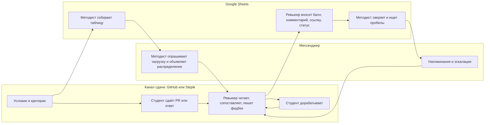
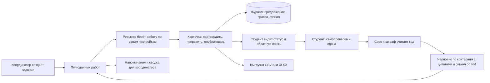

# Спецификация: Анализ процесса проверки домашних заданий и целевой процесс

**Feature Branch**: ai-core

**Created**: 2026-09-07

**Status**: Accepted for MVP

**Input**: описание кейса [sources/01-case-description.md](../../sources/01-case-description.md) и [docs/00-case.md](../../docs/00-case.md), три интервью [docs/research/01](../../docs/research/01-masha-tech-qa-2026-09-02.md), [02](../../docs/research/02-qa-reviewer-2026-09-03.md), [03](../../docs/research/03-dasha-pm-2026-09-03.md), разбор процесса [docs/02-as-is.md](../../docs/02-as-is.md), постановка [docs/01-product.md](../../docs/01-product.md), истории и метрики [docs/06-ux-and-effects.md](../../docs/06-ux-and-effects.md), сценарий [docs/07-scenario-and-growth.md](../../docs/07-scenario-and-growth.md), распределение [docs/09-assignment.md](../../docs/09-assignment.md), контракты [docs/04-contracts.md](../../docs/04-contracts.md), находки [docs/insights.md](../../docs/insights.md), платформа [docs/platforms/review-platform.md](../../docs/platforms/review-platform.md) (разделы 1–3), числа [docs/NUMBERS.md](../../docs/NUMBERS.md). Статусы реализации сверены с кодом в `backend/src/review_platform/`.

## 1. Зачем этот документ

Кейс просит разобрать текущий процесс проверки, назвать проблемы, выбрать, что автоматизировать, и спроектировать целевой процесс. Этот документ закрывает оба пункта: кто участвует, как идёт работа сейчас, где и почём она рвётся, что автоматизируем и что не будем никогда. Читатель: жюри и координатор Авито Образования, для команды это граница скоупа. Все числа из [docs/NUMBERS.md](../../docs/NUMBERS.md) или выведены из них арифметикой с пометкой «расчёт по допущениям».

## 2. Анализ

### 2.1 Источники и их вес

| Источник | Что даёт | Ограничение |
|---|---|---|
| Описание кейса | средние часы в неделю: эксперт 5–10, методист до 10, четыре системы | без разбивки по шагам |
| Интервью 01, соавтор кейса | единый пайплайн (Т01), роли (Т04), «ИИ не равно ноль баллов» (Т08) | координация обзорно |
| Интервью 02, ревьюер Tech QA | все параметры потока (Т2, Т3, Т9), практика распределения (Т10) | один курс, уже с навыком для модели |
| Интервью 03, PM Авито Академии | роль Sheets (Т15), распределение по нагрузке (Т17, Т18), два режима проверки (Т19) | со слов PM, проверить у методиста |

Скриншоты добавляют три факта: назначение живёт в GitHub, студенты под числовыми ID, в числовой колонке опечатка «ю». Собственный замер времени ревьюера с нашей системой не проведён.

### 2.2 Участники и их цели

| Роль | Чего хочет | Что на руках | Факты из интервью |
|---|---|---|---|
| Ревьюер | проверить свою долю работ в срок, не потерять качество, писать меньше текста | PR или ответ в Stepik, условие, таблица Sheets, чат | час на работу вручную (Т2), 10–15 минут с навыком (Т3), вычитывает всё от модели (Т5), понятность кода не отдаст модели (Т6), письменно обосновывает каждое снижение балла (находка 36) |
| Координатор, он же методист | запустить поток и дальше видеть только исключения, свести результат в одном месте | Google Sheets, GitHub или Stepik, мессенджер, почта | распределяет после дедлайна, объявляет в мессенджере (Т17), делит по заявленной нагрузке «готов взять только два» (Т18), Sheets нужен для сводки и копии студентам без ПДн (Т15) |
| Эксперт, автор задания | задание к своей лекции, критерии, которые нельзя просто скормить модели | условие, эталонное решение | домашки пишут эксперты своих лекций (Т04), калибровка это эталонное решение и критерии приёмки (Т1), критерии намеренно неполные (Т8) |
| Студент | быстрая конкретная обратная связь, понятный статус | PR, Stepik, документ, чат курса | доработка после дедлайна балл не меняет (Т11), два режима: с исправлением до финального срока или один проход (Т19) |
| Модератор вопросов | отфильтровать вопросы, технические передать ревьюерам | чат курса | 10–20 % вопросов уходят ревьюерам (находка 35), в MVP роль не берём |

Расхождение: по интервью 01 курс после запуска не пересматривается (Т07), а ревьюер Tech QA описал правку критериев в середине потока (находка 32). Фиксируем оба, версия критериев допускает правку внутри потока.

### 2.3 Карта текущего процесса

| Шаг | Кто | Где живёт информация | Ручные действия | Где рвётся |
|---|---|---|---|---|
| 1. Подготовка задания | методист, эксперт | условие и критерии в GitHub, Stepik или PDF, таблица в Sheets | опубликовать условие, собрать таблицу, раздать доступы внешним | критерии это текст, а не структура, таблица заново каждый поток |
| 2. Подготовка ревьюеров | методист, ревьюеры | память участников | прочитать критерии, провести встречу-калибровку | договорённости не сохраняются, новый ревьюер начинает с нуля |
| 3. Сдача и сроки | студент, методист | PR, Stepik, ссылка, чат | следить, кто сдал, напоминать, считать штраф глазами | правило штрафа в условии, но не исполняется |
| 4. Распределение | методист | Sheets, `request review` в GitHub, сообщение в чате | опросить ревьюеров о нагрузке, разложить, сообщить | один факт назначения в трёх местах |
| 5. Первичное ревью | ревьюер, методист для новичков | PR или Stepik, условие рядом | открыть работу и условие, удержать критерии в голове, найти подтверждения, написать фидбек | сопоставление с критериями самая дорогая часть, методист вычитывает фидбек новичков |
| 6. Повторное ревью | студент, ревьюер | цепочка комментариев в PR | вспомнить прошлые замечания, найти изменения | замечания и изменения ищутся вручную |
| 7. Фиксация результата | ревьюер | Sheets: балл, комментарий, ссылка, статус | ввести четыре поля руками | двойной ввод, опечатки, фидбек и сводка живут раздельно |
| 8. Контроль процесса | методист | Sheets плюс обход платформ | собрать состояние из нескольких источников, связаться с отстающими | отставание видно постфактум |

Четыре системы на одну проверку, ни один артефакт не лежит рядом со связанным. Заказчик сам говорит: данные приходится сверять, при переносе возникают ошибки и задержки.

### 2.4 Количественная модель нагрузки

Входные параметры, все из [docs/NUMBERS.md](../../docs/NUMBERS.md), все с курса Tech QA (интервью 02):

| Параметр | Значение | Пометка |
|---|---|---|
| Студентов на поток | около 100 | источник |
| Доля сдающих | около 80 % | источник |
| Ревьюеров на тип задания | 5–6 | источник |
| Работ на ревьюера, верхняя граница | до 20 | источник |
| Ручная проверка одной работы | около часа | источник |
| Проверка с навыком для модели | 10–15 минут | источник |
| Срок от закрытия приёма до отчёта студентам | 2 дня | источник |
| Методист на поддержку процесса | до 10 часов в неделю | источник, описание кейса |

Пиковая нагрузка после дедлайна, расчёт по допущениям:

| Величина | Расчёт | Результат |
|---|---|---|
| Работ на одно задание | 100 × 0.8 | 80 |
| Работ на ревьюера | 80 / 6 и 80 / 5 | 13–16, верхняя граница по интервью 20 |
| Часов ревьюера за два дня при часе на работу | 13–16 × 1 ч, до 20 × 1 ч | 13–16 часов, до 20 |
| То же в день | делим на 2 | 6.5–8 часов в день, до 10 |
| Часов ревьюера за два дня при 15 минутах на работу | 13–16 × 0.25, до 20 × 0.25 | 3.3–4 часа, до 5 |
| Проверок за поток | 100 × 12 × 2 × 0.8, допущение NUMBERS | около 1 900 |
| Часов ревьюеров за поток | 1 900 × 1 ч и 1 900 × 0.25 ч | около 1 900 против около 480 |

Вывод, расчёт по допущениям: при ручной проверке ревьюер в окне «понедельник 16:00, среда» тратит почти полный рабочий день два дня подряд поверх основной работы. Отсюда распределение по заявленной нагрузке (Т18) и неформальное «не успеваю, подхватите» (Т10).

Расхождение источников: кейс даёт 5–10 часов в неделю на эксперта, интервью даёт пик 13–20 часов за два дня. Числа совместимы, только если дедлайны идут не чаще раза в две недели. Не сглаживаем, показываем оба: среднее из кейса и пик из интервью.

Нагрузка методиста по шагам из [docs/02-as-is.md](../../docs/02-as-is.md): 1–2 часа на задание на таблицу и распределение, 1–2 часа в неделю на сроки, 2–3 часа в неделю на статусы. Это допущение команды в пределах «до 10 часов» из кейса.

### 2.5 Точки разрыва, ранжированные по цене

Десять точек разрыва из [docs/02-as-is.md](../../docs/02-as-is.md) сгруппированы по тому, чем за них платят, внутри группы по убыванию цены.

**Стоит часов эксперта.** Самая дорогая группа: час ревьюера самый дефицитный ресурс, а пик приходится на два дня.

1. Критерии заданы текстом, сопоставление возможно только глазами. По гипотезе [docs/02](../../docs/02-as-is.md) это 40 % времени ревьюера, допущение.
2. Новый ревьюер начинает с нуля, методист работает вторым ревьюером на его работах.
3. При повторном ревью замечания и изменения вспоминаются вручную.
4. Состояние процесса собирается вручную из нескольких источников, 2–3 часа в неделю методиста, допущение.
5. Назначение дублируется в трёх местах.

**Стоит ошибок.** Реже, но каждая ошибка доходит до конкретного студента.

6. Работа, статус и обратная связь живут в разных системах, сводку приходится сверять.
7. Перенос результата вручную: в числовой колонке реальной таблицы встречается буква «ю».
8. Договорённости калибровки не сохраняются, расхождения между ревьюерами возвращаются.
9. Данные о проверке не накапливаются: ни разброса оценок, ни типичных ошибок, ни времени на работу.

**Стоит задержек студенту.** Окно в два дня жёсткое, задержка видна сразу.

10. Дедлайн и правило штрафа написаны в условии, но нигде не исполняются, отставание видно постфактум.

### 2.6 Кандидаты на автоматизацию

Три оси: ценность для процесса, реализуемость за неделю хакатона, риск для контракта «решает человек» (К1 в [docs/04-contracts.md](../../docs/04-contracts.md)). Оценки словами.

| Кандидат | Ценность | Реализуемость на неделе | Риск для «решает человек» | Решение |
|---|---|---|---|---|
| Фиксация результата без ручного ввода | закрывает двойной ввод и опечатки | высокая, запись в базу и выгрузка | нет, фиксируется решение человека | MVP |
| Сроки, напоминания, штраф по правилу задания | правило есть в условии, но не исполняется | высокая, арифметика по датам | нет, штраф подтверждает ревьюер | MVP |
| Сводка статусов и просрочек | снимает 2–3 часа в неделю методиста, допущение | высокая, проекция над теми же данными | нет | MVP |
| Пул и распределение по заявленной нагрузке | убирает опрос ревьюеров и тройной учёт назначения | высокая для пула, средняя для жёсткой квоты | нет | MVP, квота частично |
| Формальные проверки кодом | дешёвые, детерминированные, отсев пустых работ | высокая, 15 примитивов | нет, это факты, не оценка | MVP |
| Сопоставление с критериями с цитатой | самая дорогая часть работы ревьюера | средняя: модель, верификация цитат, замер | средний, снят: это черновик, цитату проверяет код | MVP как черновик |
| Черновик обратной связи | ревьюер правит, а не пишет с нуля | средняя, тон должен совпасть с живыми ревьюерами | низкий, текст правит человек | MVP как черновик |
| Сигнал об ИИ с основаниями | требование кейса, у Tech QA уже вычет за «не пропустил через себя» | средняя | средний, снят запретом влиять на балл (К2) | MVP, кнопки решения план |
| Сравнение версий при доработке | штатный шаг, замечания ищутся вручную | средняя, нужна связь замечаний со строками | нет | пилот |
| Автопроверка полноты фидбека новичков | снимает с методиста роль второго ревьюера | низкая, нужны примеры хорошего фидбека | низкий | пилот |
| Автоизвлечение критериев из условия | экономит 30–60 минут на задание, допущение | средняя | средний, критерии намеренно неполные (Т8) | не делаем, ввод руками |
| Ответы студентам в чате | постоянная нагрузка модератора | низкая | средний | не в MVP |
| Итоговая оценка, санкции, спорные случаи | максимальная цена ошибки | не рассматривается | прямой запрет кейса | никогда |

Итог. В MVP идёт координация, потому что она часто, дорого и не зависит от модели, плюс предварительное ревью как черновик. На пилот уходит то, что требует данных реального потока. Итоговую оценку и последствия для студента не автоматизируем никогда.

### 2.7 Целевой процесс

| Шаг | Кто | Что появляется в системе | Статус в MVP |
|---|---|---|---|
| 0. Создание задания: текст студенту, критерии с классом и баллами, сроки, штраф, источники сдачи | координатор | версия задания, политика публикации | реализовано, `save_editor_draft`, `publish_workspace_homework`, `set_publication_policy` |
| 1. Самопроверка до сдачи, без баллов и без сигнала об ИИ | студент | снимок работы, запись в закрытом слое ревьюера | реализовано, `application/workspace/self_review.py` |
| 2. Сдача ссылкой на GitHub или Google Docs либо файлом | студент | версия сдачи, время сдачи | реализовано, `submit_work_draft`, `upload_artifact` |
| 3. Проверка срока и расчёт штрафа | система | дни просрочки, вычет | реализовано в виде ставки за день, `grading.py: grade_preview` |
| 4. Черновик по каждому критерию с цитатой, сигнал об ИИ | система | черновик ревью, стоимость и токены | реализовано, сервис prereview |
| 5. Работа в пуле, ревьюер берёт по своим настройкам | ревьюер | итерация ревью со статусом `in_review` | реализовано, `open_work`, квота частично |
| 6. Напоминания о сроке | система | уведомление внутри платформы | частично, только ревьюерам |
| 7. Карточка: принять или поправить вердикты, решить по сигналу, поправить фидбек, опубликовать | ревьюер | ревизия ревью, каждая правка в журнале | реализовано, кнопки по сигналу об ИИ план |
| 8. Спорная работа на границе зачёта уходит на второй взгляд | система, координатор | пометка «спорная» | план |
| 9. Публикация: статус, обратная связь студенту | система | `passed`, `failed` или `needs_changes` с новым сроком | реализовано, запись в Stepik и GitHub частично |
| 10. Выгрузка сводки | координатор | файл CSV или XLSX | реализовано, Google Sheets план |
| 11. Доработка: новая версия, повторная итерация у того же ревьюера | студент, ревьюер | новая версия, уведомление о правке | реализовано, отметка «замечание закрыто» план |

Одна система вместо четырёх, источник истины платформа, выгрузка односторонняя (И7). Ни одна работа не попадает в `passed` или `failed` без идентификатора подтвердившего человека (К1).

### 2.8 Что меняется для каждой роли

| Роль | Было | Стало |
|---|---|---|
| Ревьюер | открыть PR и условие, держать критерии в голове, искать подтверждения, писать фидбек, ввести четыре поля в Sheets | открыть карточку, согласиться или возразить по вердиктам, поправить строку фидбека, подтвердить |
| Координатор | собрать таблицу, опросить нагрузку, разложить, объявить в чате, следить за сроками, напоминать, сверять Sheets с GitHub | создать задание один раз, дальше сводка и исключения: напомнить или назначить с причиной |
| Эксперт, автор задания | текст критериев в условии | критерии как структура с классом проверки, студент их не видит (Д17) |
| Студент | ждать отчёта, искать замечания в цепочке комментариев | самопроверка до сдачи, статус в платформе, обратная связь с цитатами из работы |

Ручные действия ревьюера на работу. Сейчас, по шагам 5 и 7 карты: открыть работу, открыть условие, комментарий в PR, балл, комментарий, ссылка и статус в Sheets, отписка в чате. Верхняя граница восемь, число 6–8 в [docs/NUMBERS.md](../../docs/NUMBERS.md) допущение. В целевом процессе, расчёт по шагам: открыть карточку, подтвердить, опубликовать, то есть 2–3 действия без правок, плюс одно на каждую правку вердикта или строки фидбека. Ёмкость задаётся раз на спринт, не на работу.

Координатор на задание. Сейчас: таблица, опрос ревьюеров, раскладка, объявление, напоминания, сверка, без счётной границы. В целевом процессе, расчёт по шагам: две команды (сохранить, опубликовать), дальше только исключения (`remind_reviewers`, `assign_student` с причиной).

## 3. Варианты и решение

**Вариант А. Оставить процесс, добавить ИИ-проверку комментарием в PR.** Плюсы: дёшево, у Tech QA похожее уже работает. Минусы: четыре системы остаются, журнала нет, координация ручная, ошибки переноса остаются. Отвергнут: эффект координации гарантирован и не зависит от модели (П5), а этот вариант его не даёт.

**Вариант Б. Только координация: таблица, сроки, статусы, без модели.** Плюсы: ноль риска модели. Минусы: не трогает час ревьюера на работу и не закрывает обязательные функции кейса. Отвергнут как единственный, взят как базовый слой.

**Вариант В. Единая платформа как источник истины, предварительное ревью как черновик, Sheets как односторонняя выгрузка.** Выбран: убирает сверку между системами (находка 15), даёт журнал «предложение, правка, финал» (И5) и снимает пик двух дней готовым черновиком.

Решения внутри варианта В:

| Вопрос | Варианты | Решение и основание |
|---|---|---|
| Распределение | push поровну, чистый pull, гибрид | гибрид: ревьюер берёт из пула сам, координатор может назначить командой `assign_student` с причиной. Практика Авито тоже гибрид (Т10, Т18). [docs/09](../../docs/09-assignment.md) предлагал принудительное назначение только после дедлайна, в коде границы нет, расхождение зафиксировано |
| Единица ёмкости ревьюера | число работ, часы | минуты до даты (`PreferencesInput.planned_minutes`, `until_at`), Р6 из [docs/04](../../docs/04-contracts.md) закрыт кодом, документы предлагали число работ |
| Google Sheets | двусторонняя синхронизация, односторонняя выгрузка | односторонняя (И7), двусторонняя вернула бы сверку. Sheets нужен для сводки и копии студентам (Т15) |
| Критерии студенту | показать полностью в самопроверке, не показывать | не показывать (Д17): полные критерии это готовый промпт, проверено ревьюером Tech QA (Т8) |
| Критерии в систему | автоизвлечение из условия, ручной ввод | ручной ввод координатором, автоизвлечение не делаем |
| Что никогда | | итоговая оценка, санкции по сигналу об ИИ, спорные случаи без человека |

## 4. Требования

Слой процесса. Статусы сверены с кодом 7 сентября, пути от корня репозитория.

| # | Система должна | Статус в MVP | Где |
|---|---|---|---|
| FR-001 | хранить задание с критериями, классом проверки, баллами, сроками сдачи и проверки и правилом штрафа как данные, а не код | реализовано | `backend/src/review_platform/contracts/workspace.py`, поля `submission_deadline`, `review_deadline`, `penalty_per_day`, `check_class` |
| FR-002 | показывать ревьюеру пул сданных работ по выбранным потокам, скрывать пул в период отсутствия, сортировать по сроку проверки | реализовано | `application/workspace/projections.py`, запрос `works` с `view="pool"` |
| FR-003 | принимать от ревьюера заявленную ёмкость и период недоступности и учитывать их при показе пула | частично: ёмкость в минутах до даты хранится и показывается, отсутствие скрывает пул, жёсткого ограничения на число взятых работ нет | `application/workspace/catalog.py: save_preferences` |
| FR-004 | вести статусы работы `pending_review`, `in_review`, `ready_to_publish`, `published`, `passed`, `failed`, `needs_changes` и не переводить в итоговый статус без действия человека | реализовано | `application/workspace/reviews.py`, `save_review_outcome`, `publish_workspace_review` |
| FR-005 | считать просрочку сдачи и штраф по правилу задания и показывать вычет в карточке до подтверждения | частично: ставка за день и потолок по сумме баллов есть, ступень «после первого дня ноль» отдельным параметром не задаётся | `application/workspace/grading.py: grade_preview` |
| FR-006 | напоминать ревьюеру о сроке проверки до его срыва и о новой версии работы | частично: уведомления внутри платформы, срок менее 24 часов, новая версия, новая работа в пуле, только ревьюерам, студентам нет | `application/workspace/notifications.py: NotificationWorker` |
| FR-007 | давать координатору отправить напоминание выбранным ревьюерам и назначить работу с указанием причины | реализовано | `api/routes/workspace.py`, команды `remind_reviewers`, `assign_student` |
| FR-008 | показывать координатору сводку: число публикаций, среднее активное время, среднее ожидание, просрочки, долю принятых сигналов, долю изменённых решений | реализовано | `application/workspace/statistics.py: summarize_statistics` |
| FR-009 | выгружать сводку по потоку с колонками студент, балл, статус, попытка, обратная связь, ревьюер для команды или для студентов | частично: CSV и XLSX есть, интеграции с Google Sheets нет | `application/workspace/exports.py: ExportWorker` |
| FR-010 | вести журнал «предложение системы, правка человека, финал» без возможности изменить опубликованную ревизию | реализовано | `application/audit.py: AuditRecorder`, `infrastructure/db/models/review_revision.py` |
| FR-011 | отправлять спорные работы на границе зачёта на второй взгляд координатору | план, ворота: правило границы в файле задания и один прогон на корпусе | контракт К3 в [docs/04](../../docs/04-contracts.md) |
| FR-012 | записывать итог в Stepik и комментарий в GitHub | частично: контракт, автомат состояний, повторы и сверка есть, провайдер фикстурный | `application/services/deliveries.py` |

## 5. Критерии успеха

Замер времени ревьюера с нашей системой не проведён. Колонка «сейчас» это источники, колонка «цель пилота» это цели из [docs/06](../../docs/06-ux-and-effects.md), не результаты.

| # | Метрика | Сейчас | Цель пилота | Как замерим |
|---|---|---|---|---|
| SC-001 | активное время ревьюера на работу | около часа вручную, 10–15 минут с навыком Tech QA, источник | не хуже 15 минут с черновиком, на защите минус 30 % от часа | `average_elapsed_minutes` = публикация минус открытие, протокол шести работ из [docs/10](../../docs/10-benchmark.md), не проведён |
| SC-002 | часы координатора в неделю | до 10, источник | минус 60–80 % | дневник времени на пилоте, плюс число команд `assign_student` и `remind_reviewers` в журнале как прокси |
| SC-003 | доля просроченных проверок | неизвестно, кейсодатель не меряет | минус половина от базовой линии первых двух заданий пилота | `overdue_publications`: публикация позже `review_deadline` |
| SC-004 | ручных действий ревьюера на работу | 6–8, допущение | 2–3 без правок, расчёт по шагам | число команд в журнале на одну опубликованную работу |
| SC-005 | время от сдачи до обратной связи студенту | 2 дня от закрытия приёма на Tech QA, до 7 дней в продуктовых треках, источник | число не заявляем до базовой линии, ориентир: черновик за 55 секунд для лабы и около 4 минут для Go, замер | `average_wait_minutes` = публикация минус сдача |
| SC-006 | доля вердиктов, принятых без правки | нет данных | от 60 % | `changed_decisions` к `compared_decisions` в той же сводке |

## 6. Риски и ограничения

| Риск | Вероятность | Последствие | Что делаем |
|---|---|---|---|
| Базовая линия оценочная, эффект недоказуем | высокая | цифры на защите остаются расчётом | первые два задания пилота меряем как есть, потом включаем черновик |
| Все числа с одного курса Tech QA | высокая | модель нагрузки не переносится на Stepik-курсы | показываем метод, а не цифры, параметры потока подставляются |
| Ревьюеры не заявляют ёмкость, координатор возвращается к push | средняя | пул голодает, назначение снова ручное | гибрид оставлен в коде, считаем долю `assign_student` среди назначений, выше половины это сигнал |
| Пик двух дней остаётся, черновик не спасает от нехватки людей | средняя | просрочки при малом числе ревьюеров | «горящие» работы в сводке, напоминание, назначение с причиной |
| Ревьюер переписывает черновик целиком | средняя | экономия исчезает | красный флаг из [docs/06](../../docs/06-ux-and-effects.md): чаще четверти случаев, меняем промпт фидбека, не процесс |
| Полные критерии утекают студенту через API | средняя | студент подгоняет работу под проверку (Т8) | Д17: убрать `criteria` из ответа `student-context`, открытый пункт |

## 7. Допущения и открытые вопросы

1. Параметры потока Tech QA (100 студентов, 80 % сдают, 5–6 ревьюеров, до 20 работ, 2 дня) переносятся на другие курсы. Основание: одно интервью. Если неверно, меняются числа в модели нагрузки, метод остаётся.
2. Правило штрафа технических курсов такое же, как в продуктовых: минус балл за день, дальше ноль (Д1). Основание: условия заданий по фроду и бизнес-моделям. Если неверно, меняется одно поле политики публикации. Ступень «дальше ноль» сейчас выражается ставкой, равной максимуму баллов.
3. Ручных действий ревьюера сейчас 6–8. Основание: перечень шагов карты, верхняя граница восемь. Если неверно, меняется базовая линия SC-004, цель 2–3 остаётся расчётом по шагам.
4. Доли времени ревьюера 10 / 40 / 30 / 20 и разбивка часов методиста по шагам. Основание: оценки команды в [docs/02](../../docs/02-as-is.md). Если неверно, меняется, где именно мы экономим, цель SC-002 пересчитывается по дневнику пилота.
5. Ревьюеры примут ёмкость в минутах до даты, а не в числе работ. Основание: решение в коде, Р6 закрыт. Если неверно, меняется одно поле настроек.
6. Открыто: как часто пул голодает по теме при чистом pull. Авито этого не сказали, неформальное «подхватите» намекает, что случается.
7. Открыто: сколько итераций доработки бывает на курс и как часто бывают апелляции. Влияет на приоритет сравнения версий и на журнал.
8. Открыто: где на Stepik-курсах проходит срок проверки, 2 дня или 7. Срок это параметр задания (Д2), но базовую линию SC-005 без ответа не собрать.
